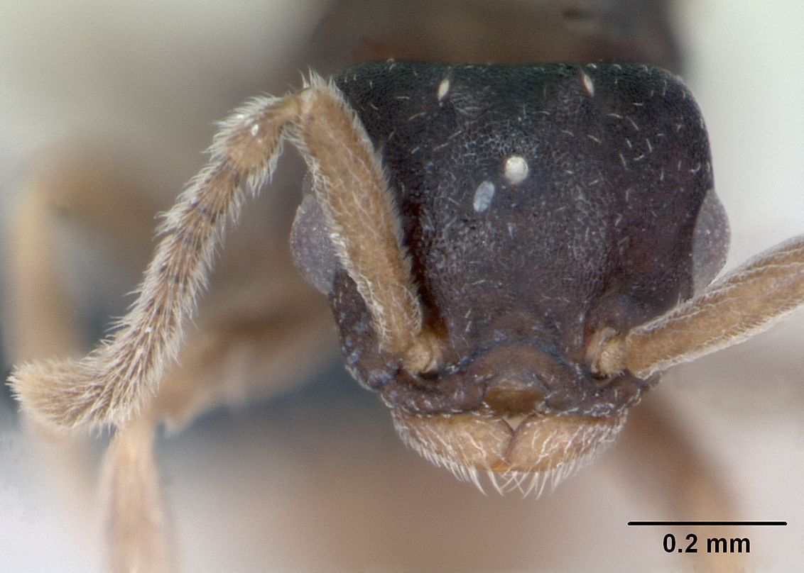
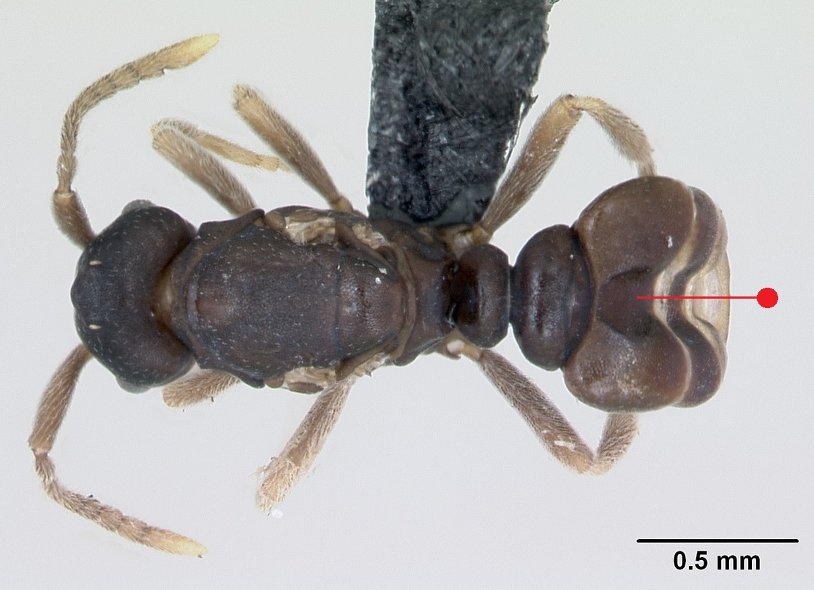
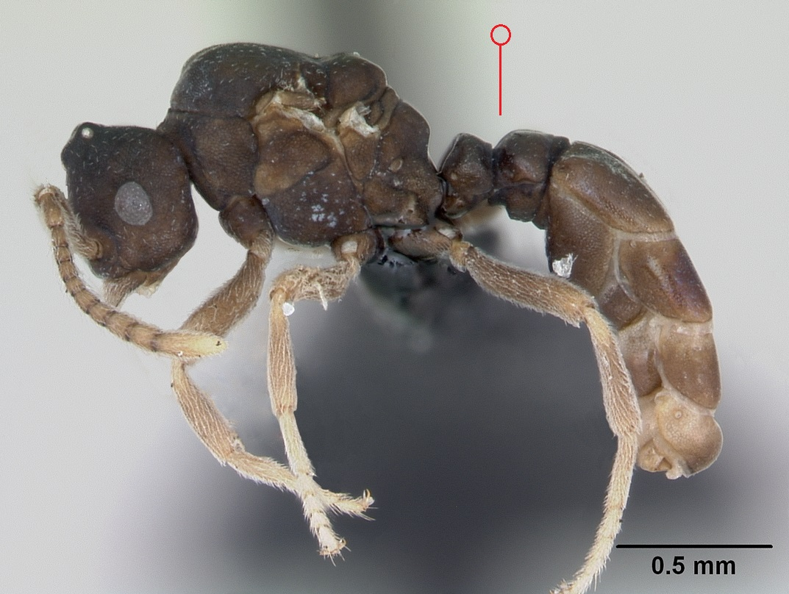
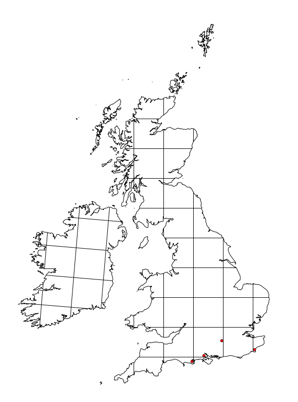

# **Anergates atratulus** (Schenck, 1852)

```{marginfigure}
```

```{r eval=TRUE, echo=FALSE, purl=FALSE, fig.margin = TRUE}

```

```{r eval=TRUE, echo=FALSE, purl=FALSE, fig.margin = TRUE}

```

```{r eval=TRUE, echo=FALSE, purl=FALSE}

```

```{block, type="attribution"}
Photos by April Nobile / From www.antweb.org. Accessed 21 September 2016.
Image Copyright © AntWeb 2002 - 2016. Licensing: Creative Commons Attribution License.
```

## Alates
Member of *Myrmicinae* with **two segments to waist** and **sting present**.

Queen with **median longitudinal depression on the dorsal surface of the gaster**, becoming massively swollen with eggs. ^[physogastric] Male pupoidal and **wingless**.

Mating occurs within the host nest with many mated queens flying out from  May to August in search of new host nests. Either adopt an old queenless colony of *Tetramorium caespitum* or host queen killed or starved.

## Nest
Parasitic on *Tetramorium caespitum*, with no workers. No new host workers produced as entire host resources switched to producing large numbers of new *Anergates atratulus* queens and males. Host colony dies out within two to five years. 

Unlike the host's white larvae with hairs on head, larvae **yellow** with **naked head**. Pupae naked.

```{r eval=TRUE, echo=FALSE, purl=FALSE, fig.margin = TRUE}

```
`r margin_note("Data courtesy of the NBN Gateway and provided by BWARS.")`
`r margin_note("Crown copyright and database rights 2011 Ordnance Survey [100017955].")`

\pagebreak
