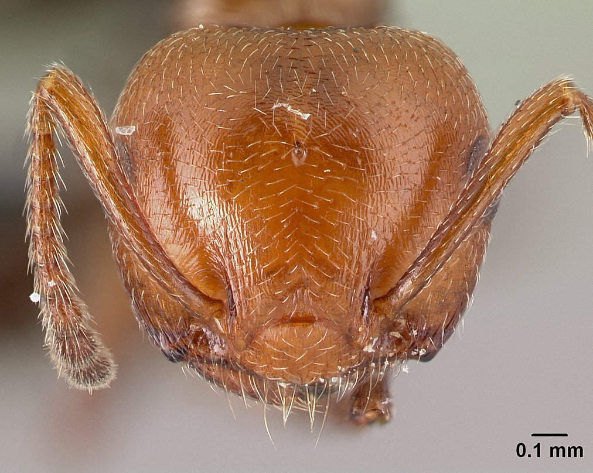
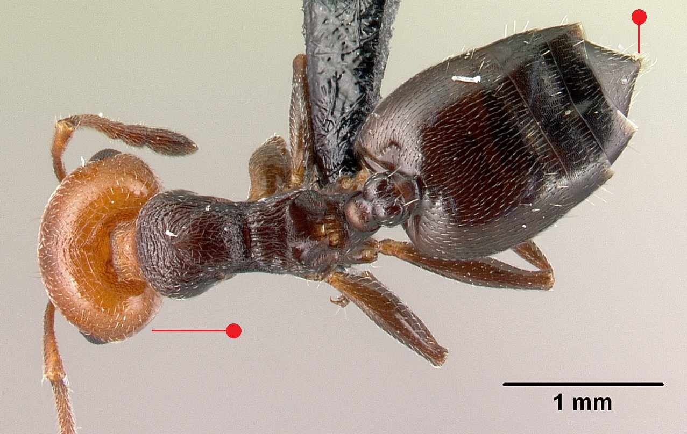
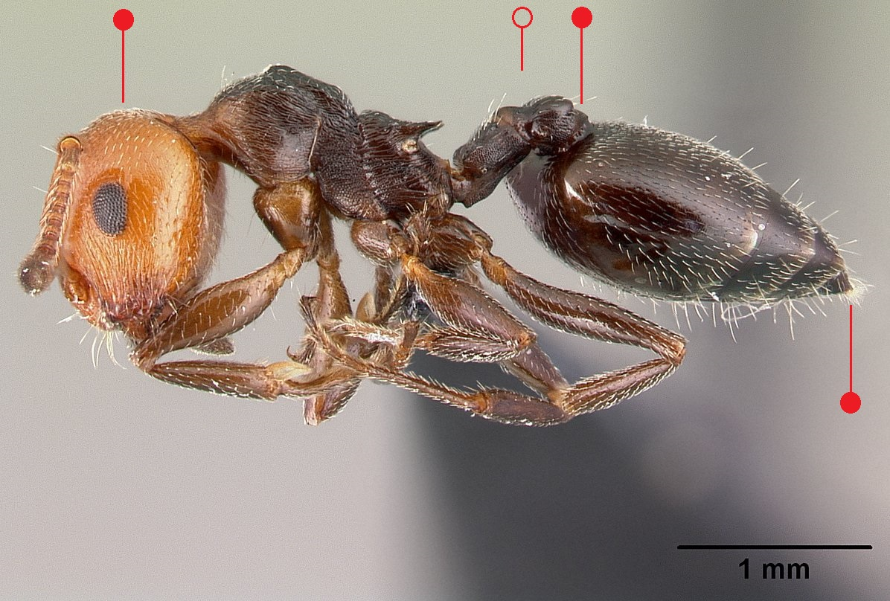

# **Crematogaster scutellaris** (Olivier, 1792)

```{marginfigure}
```

```{r eval=TRUE, echo=FALSE, purl=FALSE, fig.margin = TRUE}

```

```{r eval=TRUE, echo=FALSE, purl=FALSE, fig.margin = TRUE}

```

```{r eval=TRUE, echo=FALSE, purl=FALSE, fig.margin = TRUE}

```

```{r eval=TRUE, echo=FALSE, purl=FALSE}

```

```{block, type="attribution"}
Photos by Erin Prado / From www.antweb.org. Accessed 12 December 2016.
Image Copyright © AntWeb 2002 - 2016. Licensing: Creative Commons Attribution License.
```


## Worker
Introduced member of *Myrmicinae* imported with cork from Southern Europe, though has never established within Britain. Has two segments to waist and sting present.

Reddish head with black thorax and abdomen which narrows towards the apex. [Postpetiole](#glossary) inserted high on abdomen which is raised when attacked, releasing pheromone that causes mobilisation of other workers.

Predator on invertebrates and tends aphids for honeydew.

## Nest
Colonies in stumps and fallen dead wood, formed by a single or few queens with up to several tens of thousands of workers. Pupae naked.

```{r eval=TRUE, echo=FALSE, purl=FALSE, fig.margin = TRUE}
knitr::include_graphics("images//Crematogaster_scutellaris//Crematogaster_scutellaris_map.png")
```
`r margin_note("Data courtesy of the NBN Gateway and provided by BWARS.")`
`r margin_note("Crown copyright and database rights 2011 Ordnance Survey [100017955].")`

\pagebreak

