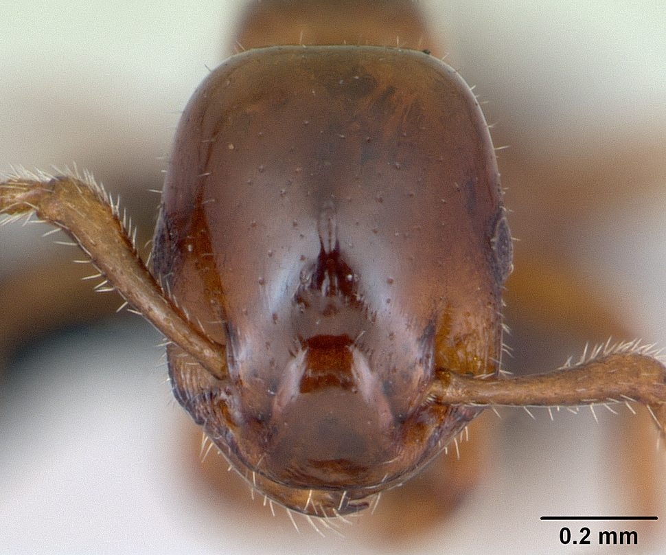
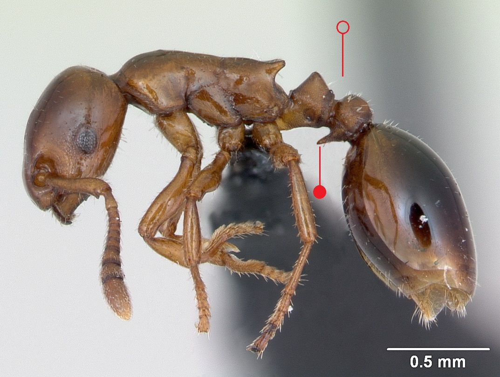
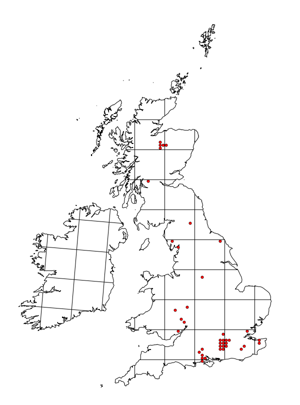

# **Formicoxenus nitidulus** (Nylander, 1846)

```{marginfigure}
```

```{r eval=TRUE, echo=FALSE, purl=FALSE, fig.margin = TRUE}

```

```{r eval=TRUE, echo=FALSE, purl=FALSE}

```

```{block, type="attribution"}
Photos by April Nobile / From www.antweb.org. Accessed 20 September 2016.
Image Copyright © AntWeb 2002 - 2016. Licensing: Creative Commons Attribution License.
```

## Worker
Member of *Myrmicinae* with **two segments to waist** and **sting present**.

Upper surface of head and thorax smooth and shining with black gaster. **Projection on underside of post-petiole**.

Individuals may obtain food from *Formica* workers and can be seen on surface of *Formica* nests in warm, dull, humid days.

## Nest
Inquiline species ^[one or more nests in *Formica rufa*, *F. lugubris* and *F. aquilonia* mounds] with nests of single queen and up to one hundred workers in sticks, tough bark or dead bracken stems. Pupae naked.

```{r eval=TRUE, echo=FALSE, purl=FALSE, fig.margin = TRUE}

```
`r margin_note("Data courtesy of the NBN Gateway and provided by BWARS.")`
`r margin_note("Crown copyright and database rights 2011 Ordnance Survey [100017955].")`

## Alates
Mating occurs on surface of *Formica* nests between July to August, with males found on the surface between August to October, especially early in the morning. Intermediate reproduction forms between the queen and worker can occur. Male similar to workers, **wingless** with **longer curved antennae**. Unlike workers queen with **12 antennal segments** and **ocelli**.

\pagebreak