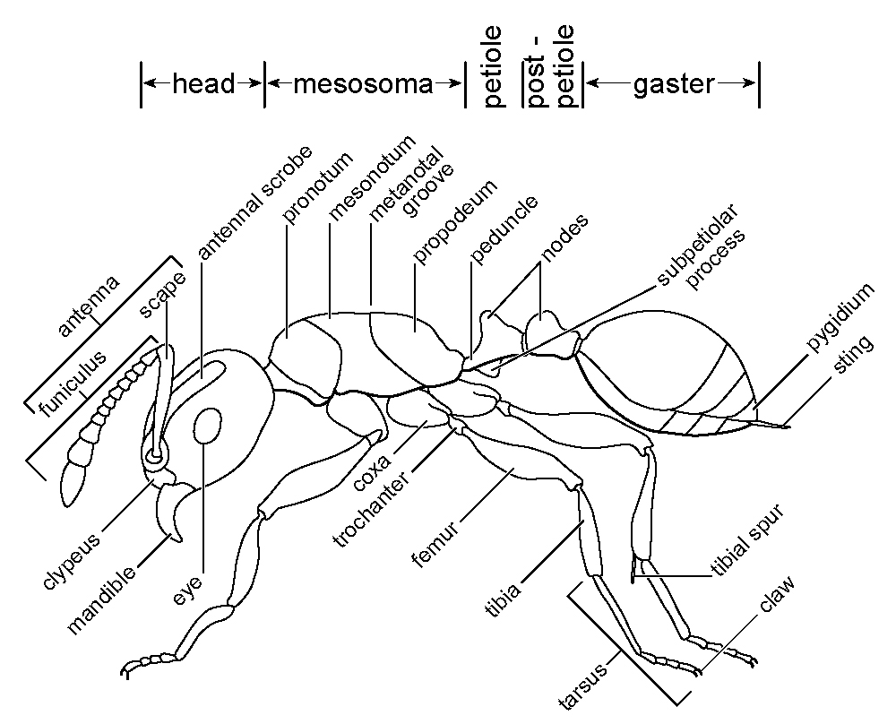
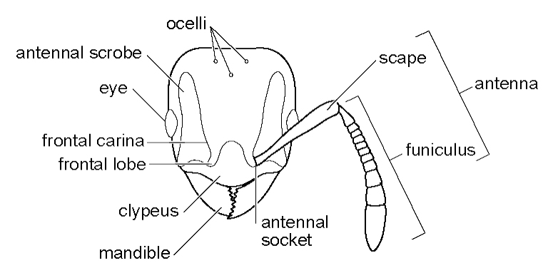

# **Glossary** {-}

```{r eval=TRUE, echo=FALSE, purl=FALSE, fig-nocap-fullwidth, fig.fullwidth = TRUE}

```

```{r eval=TRUE, echo=FALSE, purl=FALSE}

```

\begin{fullwidth}
```{block, type="attribution"}
Drawings by Steve Shattuck, Australian National Insect Collection, Canberra, Australia / From http://www.antwiki.org/wiki/Morphological_Terms. Accessed 09 November 2016. Licensing: Creative Commons Attribution-Share Alike Licence.
```
\end{fullwidth}

\pagebreak

