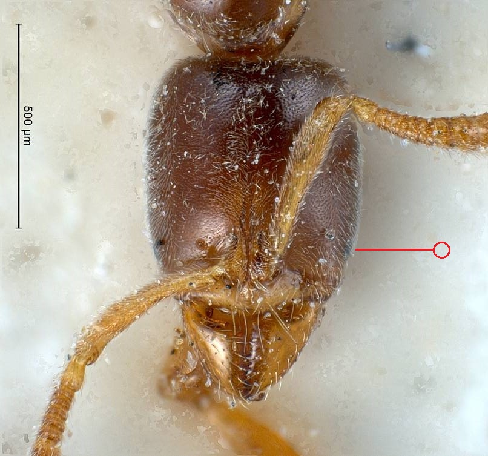
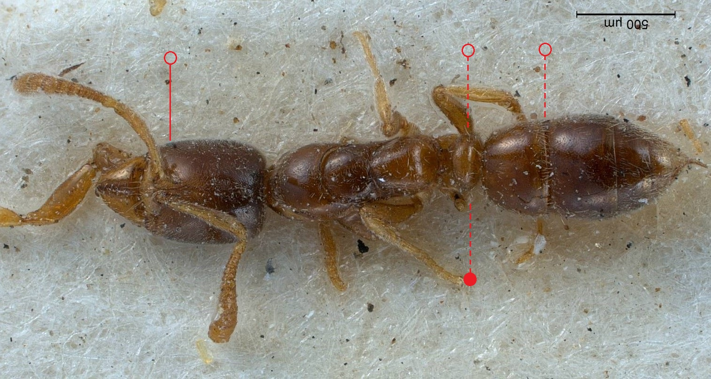

# **Hypoponera ergatandria** (Forel, 1893)

```{marginfigure}
```

```{r eval=TRUE, echo=FALSE, purl=FALSE, fig.margin = TRUE}
knitr::include_graphics("images//labels//tramp.png")
```

```{r eval=TRUE, echo=FALSE, purl=FALSE, fig.margin = TRUE}

```

```{r eval=TRUE, echo=FALSE, purl=FALSE}

```

```{block, type="attribution"}
Photos by Roland Schultz / From www.antweb.org. Accessed 23 November 2016.
Image Copyright © AntWeb 2002 - 2016. Licensing: Creative Commons Attribution License.
```

## Worker
Introduced member of subfamily *Ponerinae*. Has single thick waisted segment, constriction between first and second [gaster](#glossary) segments and well developed sting. Head with minute eyes.

Differing from *Hypoponera punctatissima* by a number of morphometric measurements including width of head width and length of [scape](#glossary) (@Seifert-2013).

Predator on small invertebrates.

## Nest
Underground colonies containing several queens and around 200 workers, in greenhouses and other permanently heated buildings. Pupae enclosed in cocoons.

```{r eval=TRUE, echo=FALSE, purl=FALSE, fig.margin = TRUE}
knitr::include_graphics("images//Hypoponera_ergatandria//Hypoponera_ergatandria_map.png")
```
`r margin_note("Data courtesy of the NBN Gateway and provided by BWARS.")`
`r margin_note("Crown copyright and database rights 2011 Ordnance Survey [100017955].")` 

## Alates
Mating flight period November to February. Males are wingless.

\pagebreak