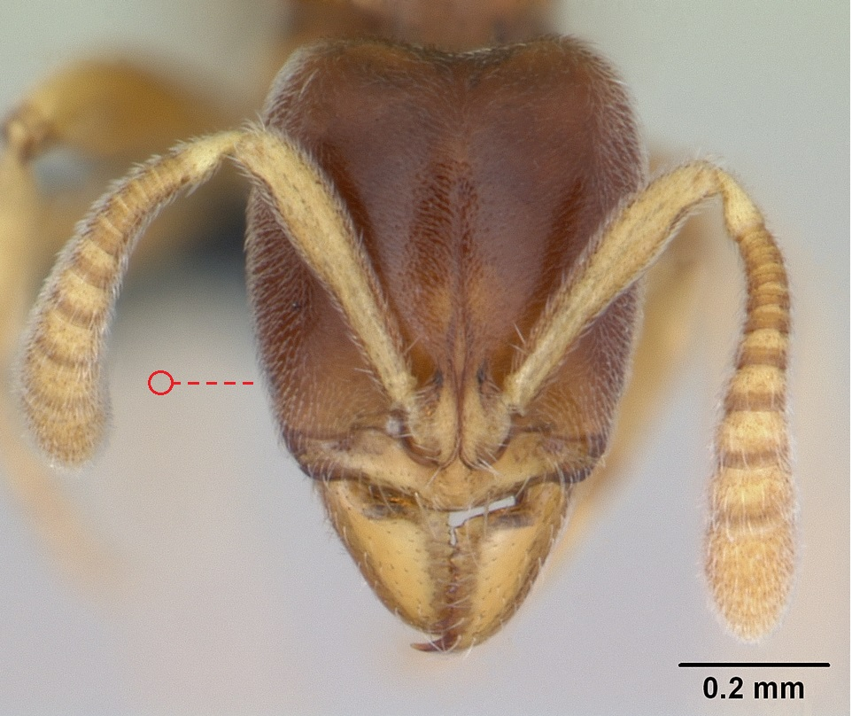
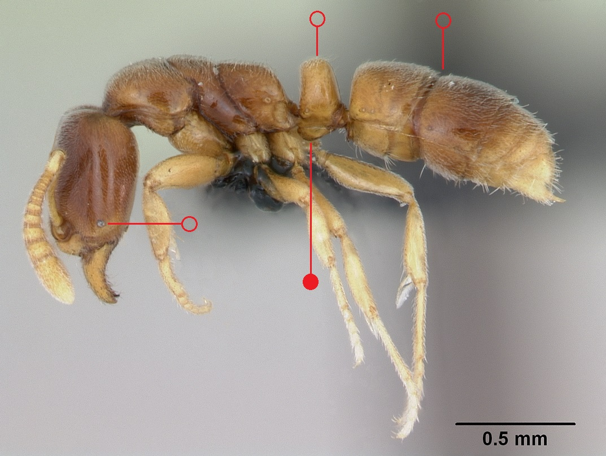

# **Hypoponera punctatissima** (Roger, 1859)

```{marginfigure}
```

```{r eval=TRUE, echo=FALSE, purl=FALSE, fig.margin = TRUE}
knitr::include_graphics("images//labels//tramp.png")
```

```{r eval=TRUE, echo=FALSE, purl=FALSE, fig.margin = TRUE}

```

```{r eval=TRUE, echo=FALSE, purl=FALSE, fig.margin = TRUE}

```

```{r eval=TRUE, echo=FALSE, purl=FALSE}

```
```{block, type="attribution"}
Photos by April Nobile (worker) and Erin Prado (queen) / From www.antweb.org. Accessed 17 September 2016.
Image Copyright © AntWeb 2002 - 2016. Licensing: Creative Commons Attribution License.
```

## Worker
Introduced member of subfamily *Ponerinae*  often imported with plant material. Has single thick waisted segment, constriction between first and second [gaster](#glossary) segments and well developed sting. Head with minute eyes.

Unlike *Ponera coarcta* finely punctured with no [subpetiolar process](#glossary).

Predator on small invertebrates.

## Nest
In heated buildings, fermenting rubbish dumps and sawdust heaps with numerous workers. Pupae enclosed in cocoons. ...(@Stradling-1965; @Timmins-1993; @Donisthorpe-1946).

```{r eval=TRUE, echo=FALSE, purl=FALSE, fig.margin = TRUE}

```
`r margin_note("Data courtesy of the NBN Gateway and provided by BWARS.")`
`r margin_note("Crown copyright and database rights 2011 Ordnance Survey [100017955].")`

## Alates
Mating flights in August and September consisting of numerous queens. Male dimorphic with small and large individuals, unwinged with 12 [antennal segments](#glossary) and no spine on [pygidium](#glossary). Queen has larger eyes that are near the base of the [mandibles](#glossary).

\pagebreak