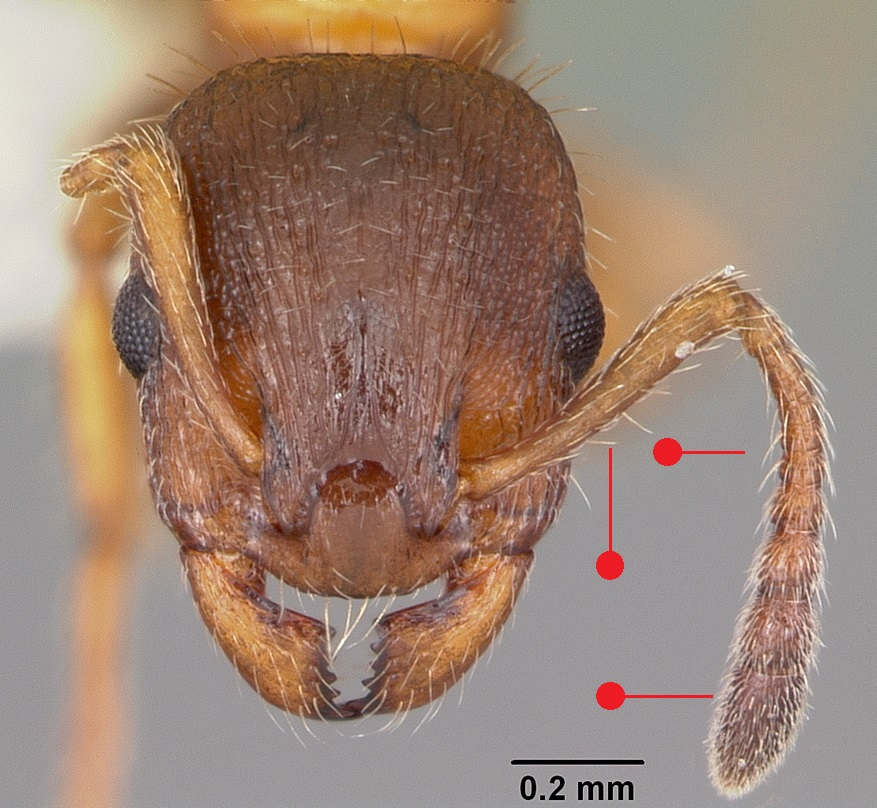
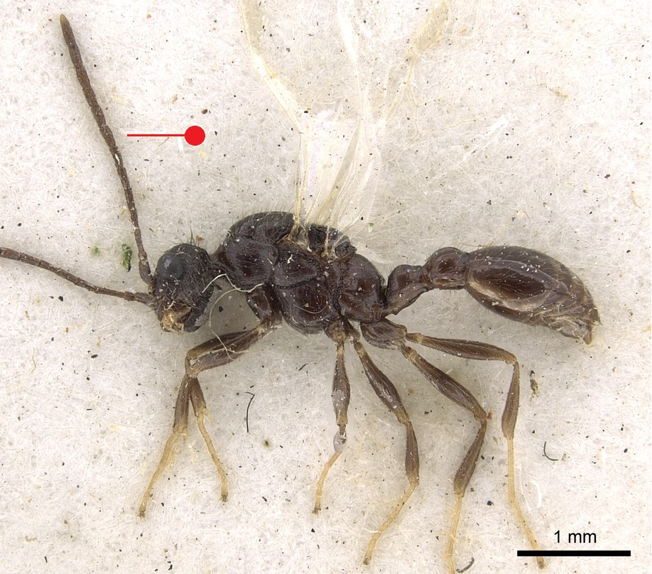
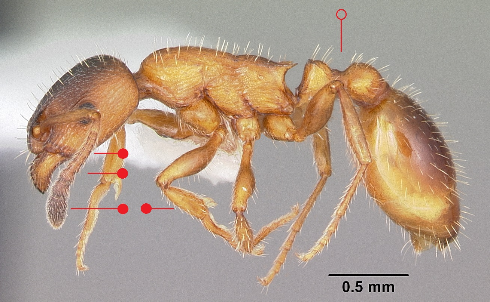

# **Leptothorax acervorum** (Fabricius, 1793)

```{marginfigure}
```

```{r eval=TRUE, echo=FALSE, purl=FALSE, fig.margin = TRUE}

```

```{r eval=TRUE, echo=FALSE, purl=FALSE, fig.margin = TRUE}

```

```{r eval=TRUE, echo=FALSE, purl=FALSE}

```

```{block, type="attribution"}
Photos by April Nobile (worker) and Ryan Perry (male) / From www.antweb.org. Accessed 31 October 2016.
Image Copyright © AntWeb 2002 - 2016. Licensing: Creative Commons Attribution License.
```

## Worker
Member of *Myrmicinae* with **two segments to waist** and **sting present**.

Unlike *Temnothorax* species, **antennae with eleven segments** and **erect long hairs on scape**, as well as tibiae. Antennal club, head and abdomen darkened.

Small non-aggressive ant that does not produce scent to avoid detection by other ant species, using pair-running to forage for food, taking scraps of food, dead corpses and nest rubbish from *Formica aquilonia*, *Formica lugubris* and *Formica exsecta* colonies, licking honeydew from leaves and eating small arthropods.

## Nest
Small nests under bark usually in dead wood, open pine woods with dead sticks on the ground, sometimes in stone walls or peaty topsoil of heaths, with one queen and less than twenty workers, though occasionally much larger nests with many queens. Pupae naked.

```{r eval=TRUE, echo=FALSE, purl=FALSE, fig.margin = TRUE}
knitr::include_graphics("images//leptothorax_acervorum//leptothorax_acervorum_map.png")
```
`r margin_note("Data courtesy of the NBN Gateway and provided by BWARS.")`
`r margin_note("Crown copyright and database rights 2011 Ordnance Survey [100017955].")`

## Alates
Mating flights in July. Unlike *Temnothorax* species male with **twelve antennal segments**.

\pagebreak