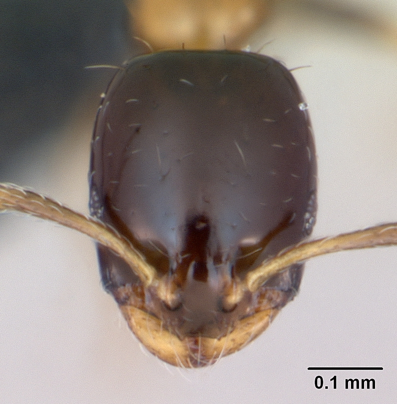
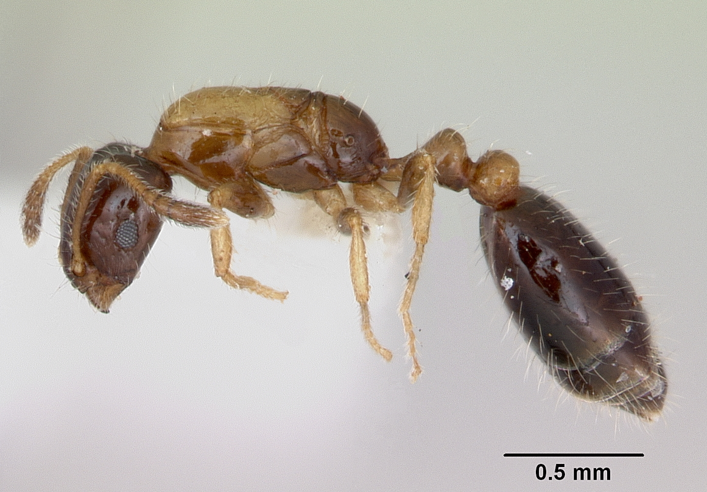
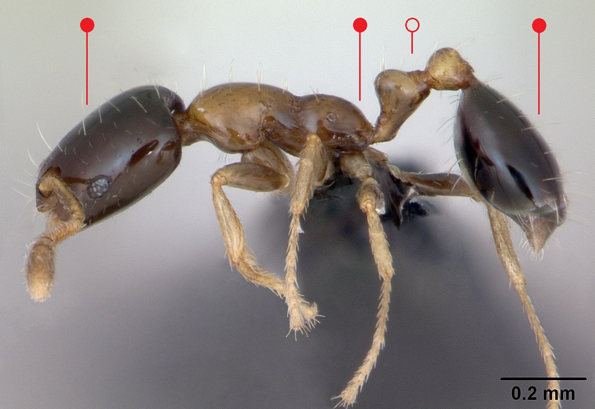

# **Monomorium floricola** (Jerdon, 1851)

```{marginfigure}
```

```{r eval=TRUE, echo=FALSE, purl=FALSE, fig.margin = TRUE}
knitr::include_graphics("images//labels//tramp.png")
```

```{r eval=TRUE, echo=FALSE, purl=FALSE, fig.margin = TRUE}

```

```{r eval=TRUE, echo=FALSE, purl=FALSE, fig.margin = TRUE}

```

```{r eval=TRUE, echo=FALSE, purl=FALSE}

```

```{block, type="attribution"}
Photos (worker and queen) by April Nobile / From www.antweb.org. Accessed 5 January 2017.
Image Copyright © AntWeb 2002 - 2016. Licensing: Creative Commons Attribution License.
```

## Worker
Introduced member of subfamily *Myrmicinae*, dispersed by human commercial activity, with two segments to waist and sting present.

Like *Monomorium pharaonis* [propodeum](#glossary) rounded with no spines but bicoloured with uniformly dark brown head and [gaster](#glossary).

Slow moving workers forming trails scavenging on household food material.

## Nest
In small cavities of heated buildings and greenhouses, with multiple small nests containing many queens, new nest formed by budding. Pupae naked [@Wetterer-2010].

```{r eval=TRUE, echo=FALSE, purl=FALSE, fig.margin = TRUE}

```
`r margin_note("Data courtesy of the NBN Gateway and provided by BWARS.")`
`r margin_note("Crown copyright and database rights 2011 Ordnance Survey [100017955].")`

## Alates
Queens are wingless.

\pagebreak