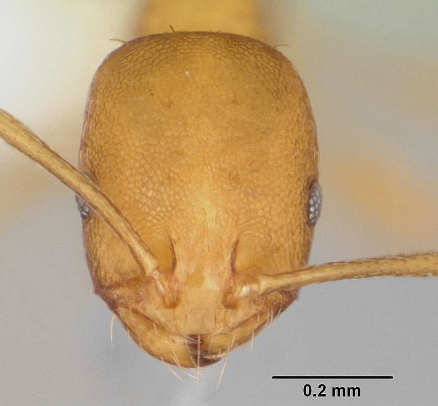
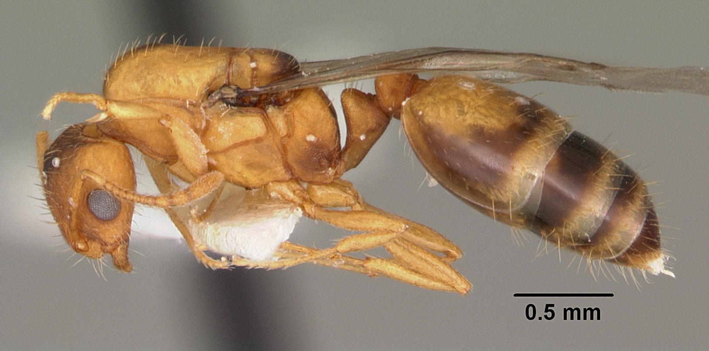
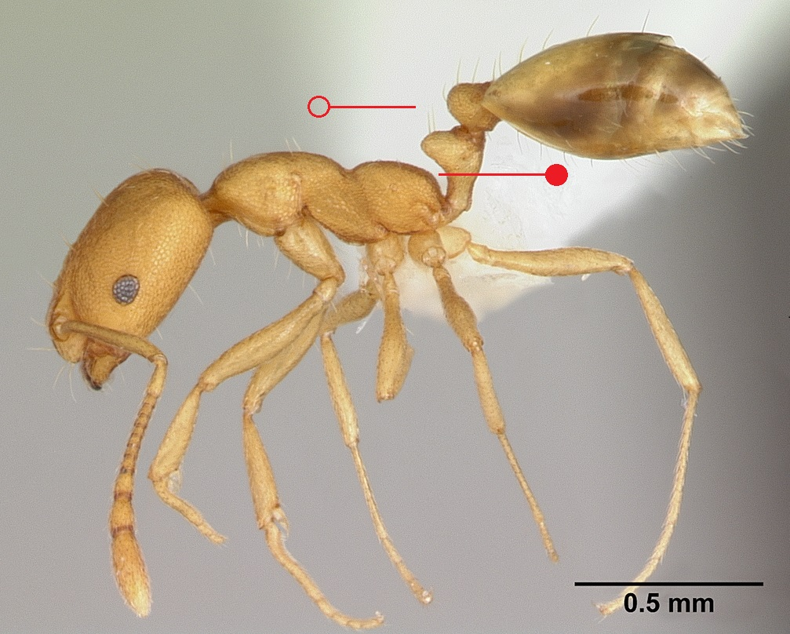
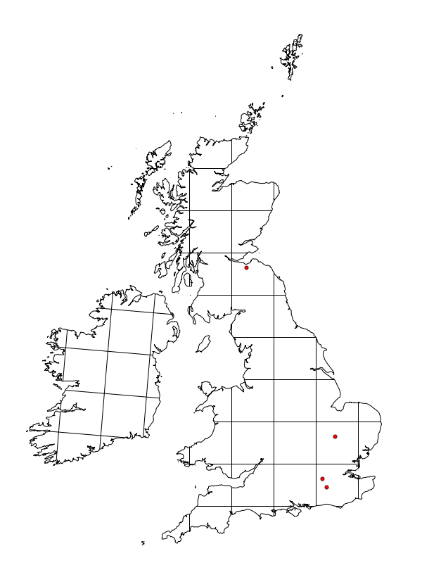

# **Monomorium pharaonis** (Linnaeus, 1758)

```{marginfigure}
```

```{r eval=TRUE, echo=FALSE, purl=FALSE, fig.margin = TRUE}
knitr::include_graphics("images//labels//tramp.png")
```

```{r eval=TRUE, echo=FALSE, purl=FALSE, fig.margin = TRUE}

```

```{r eval=TRUE, echo=FALSE, purl=FALSE, fig.margin = TRUE}

```

```{r eval=TRUE, echo=FALSE, purl=FALSE}

```
```{block, type="attribution"}
Photos (worker and queen) by April Nobile / From www.antweb.org. Accessed 26 September 2016.
Image Copyright © AntWeb 2002 - 2016. Licensing: Creative Commons Attribution License.
```

## Worker
Introduced member of subfamily *Myrmicinae* with two segments to waist and sting present.

Dull matt head, **[mesosoma](#glossary)** and **[petiole](#glossary)** with shiny **[gaster](#glossary)**. **[Propodeum](#glossary)** rounded with no spines.

Scavenger on food material, dead animals and insects, forming long foraging trails.

## Nest
In foundations, walls and under floors of heated buildings, for example hospitals, with large colonies consisting of multiple connecting nests containing many queens and several million workers. Pupae naked. ... (@Edwards-1981) 

```{r eval=TRUE, echo=FALSE, purl=FALSE, fig.margin = TRUE}

```
`r margin_note("Data courtesy of the NBN Gateway and provided by BWARS.")`
`r margin_note("Crown copyright and database rights 2011 Ordnance Survey [100017955].")`

\pagebreak