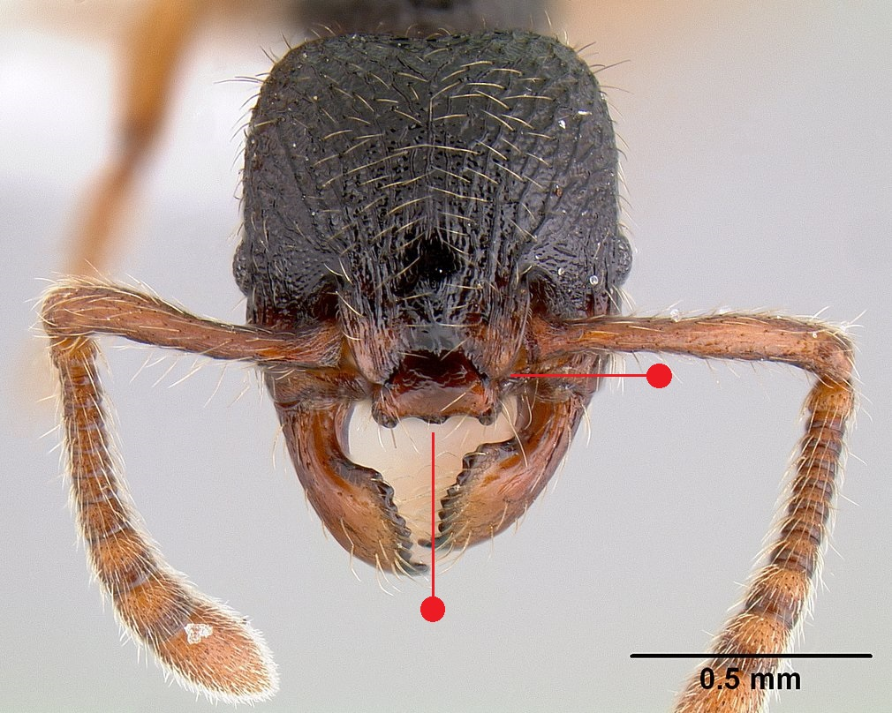
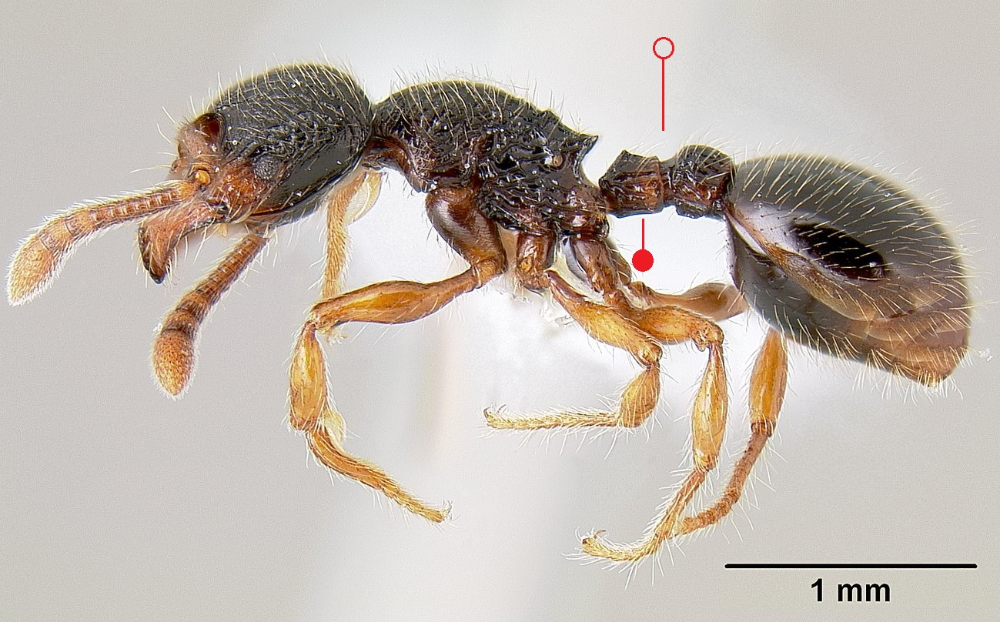
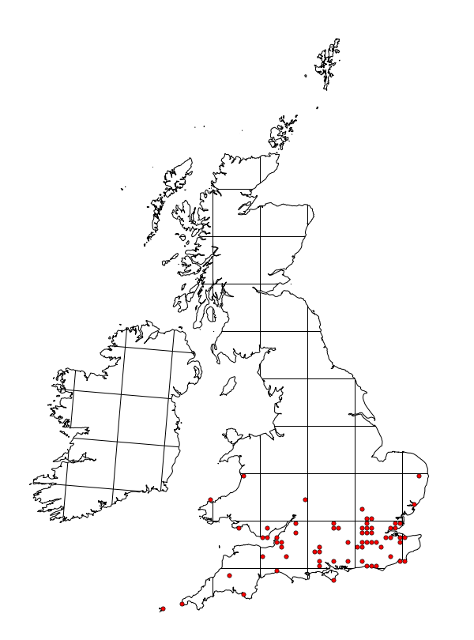

# **Myrmecina graminicola** (Latreille, 1802)

```{marginfigure}
```

```{r eval=TRUE, echo=FALSE, purl=FALSE, fig.margin = TRUE}

```

```{r eval=TRUE, echo=FALSE, purl=FALSE}

```
```{block, type="attribution"}
Photos by Michael Branstetter / From www.antweb.org. Accessed 19 September 2016.
Image Copyright © AntWeb 2002 - 2016. Licensing: Creative Commons Attribution License.
```

## Worker
Member of *Myrmicinae* with **two segments to waist** and **sting present**.

Dark heavily sculptured species with pair of ridges on lower surface of head and **clypeus with two anterior teeth**. **Petiole quadrangular without distinct peduncle**. ^[anterior connecting part of the petiole].

Slow moving subterranean ant, curling up when disturbed, often found individually in nests of other ant species. Scavenges and preys on small invertebrates. Collected using mince meat baits under stones.

## Nest
Under embedded stones, hollow flints, fallen wood, dead tree stumps, soil and under moss with single queen and fewer than 100 workers, as well as one or more intercastes, intemediate form between workers and queen. Nest in hottest sites which do not dry out, cliffs, pastures and dry open woodland. Clay patches on chalk downs with *Ponera coarctata*. Pupae naked.

```{r eval=TRUE, echo=FALSE, purl=FALSE, fig.margin = TRUE}

```
`r margin_note("Data courtesy of the NBN Gateway and provided by BWARS.")`
`r margin_note("Crown copyright and database rights 2011 Ordnance Survey [100017955].")`

## Alates
Mating flights in August and October. Male has **dark wings**.

\pagebreak