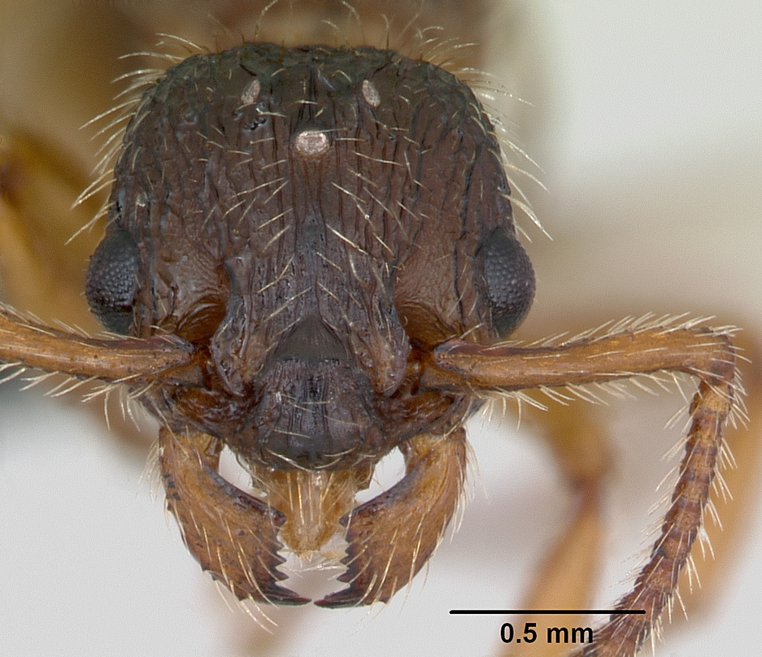
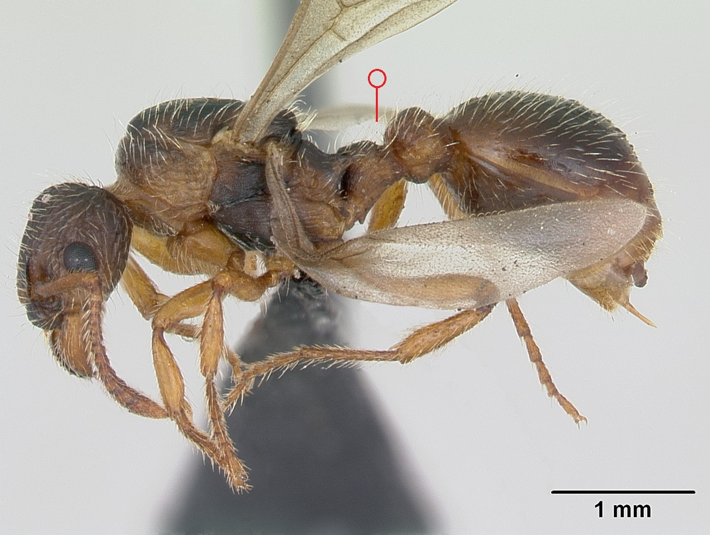
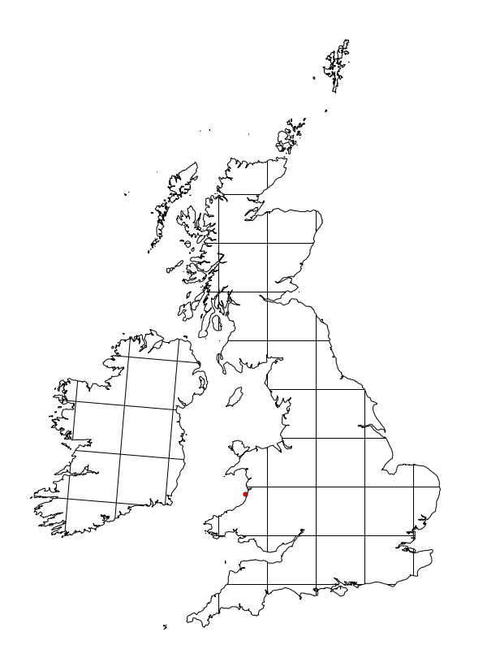

# **Myrmica hirsuta** Elmes, 1978

```{marginfigure}
```

```{r eval=TRUE, echo=FALSE, purl=FALSE, fig.margin = TRUE}

```

```{r eval=TRUE, echo=FALSE, purl=FALSE}

```

```{block, type="attribution"}
Photos by April Nobile / From www.antweb.org. Accessed 14 October 2016.
Image Copyright © AntWeb 2002 - 2016. Licensing: Creative Commons Attribution License.
```

## Alates
Member of *Myrmicinae* with **two segments to waist** and **sting present**.

**Smaller than host** with **abundant long erect hairs**.

## Nest
Parasitic on *Myrmica sabuleti*, with workers rarely produced. Host continues to produce workers but alates are all *Myrmica hirsuta*. Pupae naked.

```{r eval=TRUE, echo=FALSE, purl=FALSE, fig.margin = TRUE}

```
`r margin_note("Data courtesy of the NBN Gateway and provided by BWARS.")`
`r margin_note("Crown copyright and database rights 2011 Ordnance Survey [100017955].")`

\pagebreak