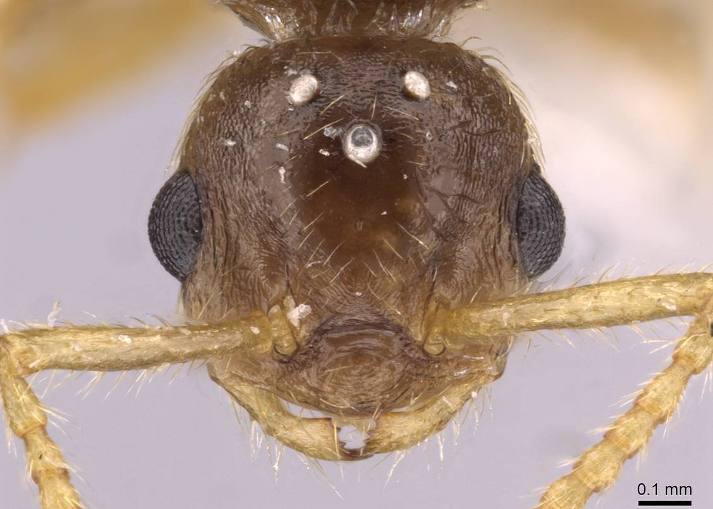
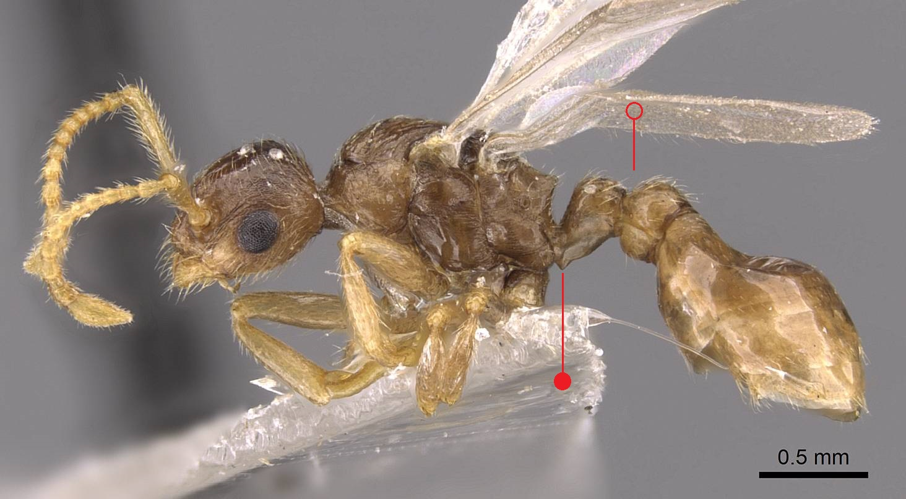
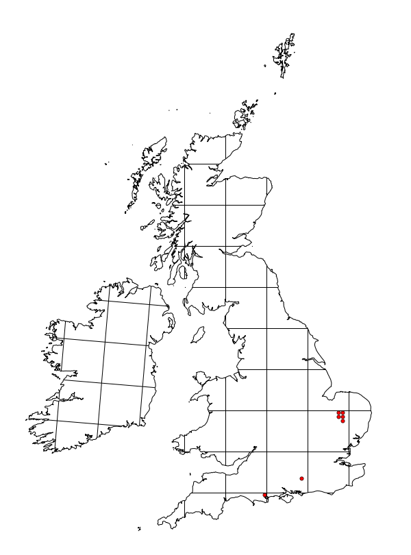

# **Myrmica karavajevi** (Arnol'di, 1930)

```{marginfigure}
```

```{r eval=TRUE, echo=FALSE, purl=FALSE, fig.margin = TRUE}

```

```{r eval=TRUE, echo=FALSE, purl=FALSE, fig.margin = TRUE}

```

```{r eval=TRUE, echo=FALSE, purl=FALSE}

```

```{block, type="attribution"}
Photos by Zach Lieberman / From www.antweb.org. Accessed 14 October 2016.
Image Copyright © AntWeb 2002 - 2016. Licensing: Creative Commons Attribution License.
```

## Alates
Member of *Myrmicinae* with two segments to waist and sting present.

Smaller than host. Queen with projection on underside of **[petiole](#glossary)**. Male has 12 **[antennal segments](#glossary)**.

Flight period usually July or August.

## Nest
Parasitic on *Myrmica scabrinodis* and *Myrmica sabuleti*, with no workers, in host nests usually in warm and relatively wet places, bogs, marshes, damp heaths, meadows and forest clearings. Host continues to produce workers but alates are all *Myrmica karavajevi* which are produced in large numbers. Pupae naked.

```{r eval=TRUE, echo=FALSE, purl=FALSE, fig.margin = TRUE}

```
`r margin_note("Data courtesy of the NBN Gateway and provided by BWARS.")`
`r margin_note("Crown copyright and database rights 2011 Ordnance Survey [100017955].")`

\pagebreak