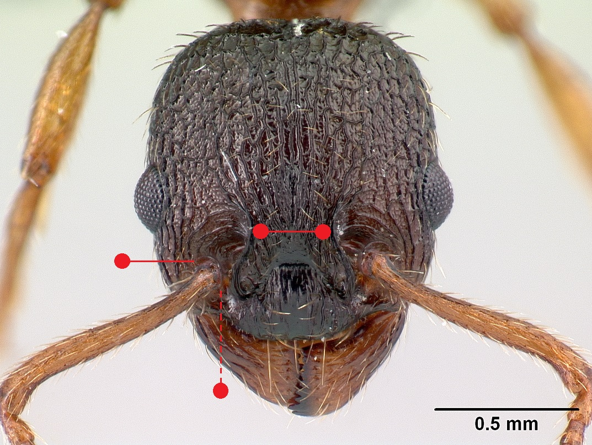
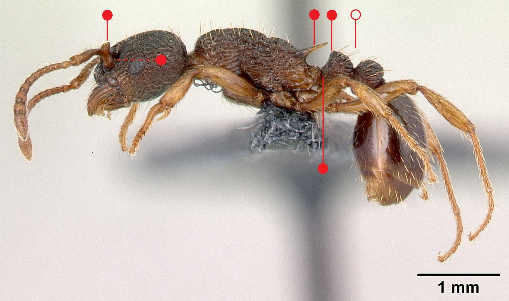
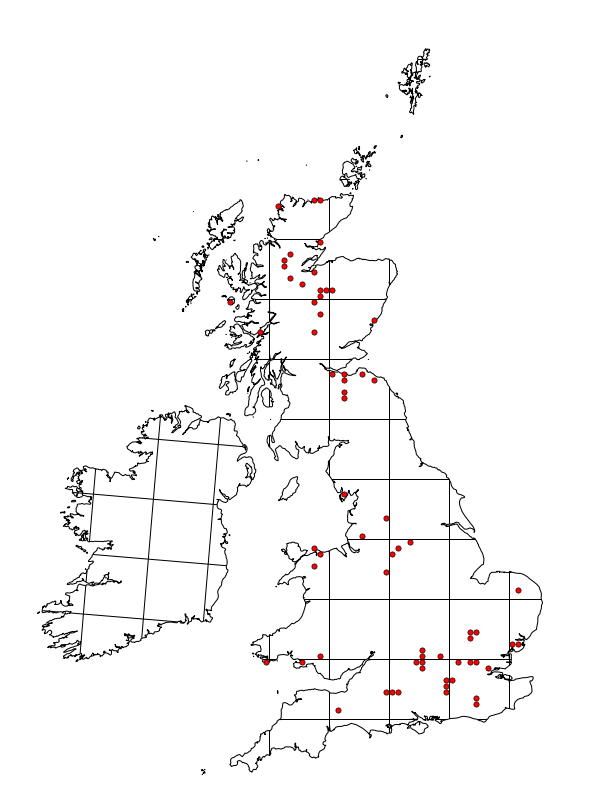

# **Myrmica lobicornis** Nylander, 1846

```{marginfigure}
```

```{r eval=TRUE, echo=FALSE, purl=FALSE, fig.margin = TRUE}

```

```{r eval=TRUE, echo=FALSE, purl=FALSE}

```

```{block, type="attribution"}
Photos by Erin Prado / From www.antweb.org. Accessed 11 October 2016.
Image Copyright © AntWeb 2002 - 2016. Licensing: Creative Commons Attribution License.
```

## Worker
Member of *Myrmicinae* with **two segments to waist** and **sting present**.

**Antennal scape angled with ball and socket joint on different axis** and **tooth or vertical lobe at base**. Unlike *Myrmica schencki* **frons about one third width of head**, about equal distance with antennae to outer edge of head as well as **petiole with very short peduncle** and **front surface acutely angled into top face**. **Propodeal spines short and stout**.

Non-aggressive ant that is unlikely to sting, mostly scavenging invertebrates.

## Nest
In ground or under stones at margins of hot heathland sites which no longer have heathland vegetation, open woodland and upland and mountainous areas. One or two queens per nest with ten to few hundred workers. Pupae naked. 

```{r eval=TRUE, echo=FALSE, purl=FALSE, fig.margin = TRUE}

```
`r margin_note("Data courtesy of the NBN Gateway and provided by BWARS.")`
`r margin_note("Crown copyright and database rights 2011 Ordnance Survey [100017955].")`

## Alates
Unlike *Myrmica schencki* males have **long scapes**.

\pagebreak