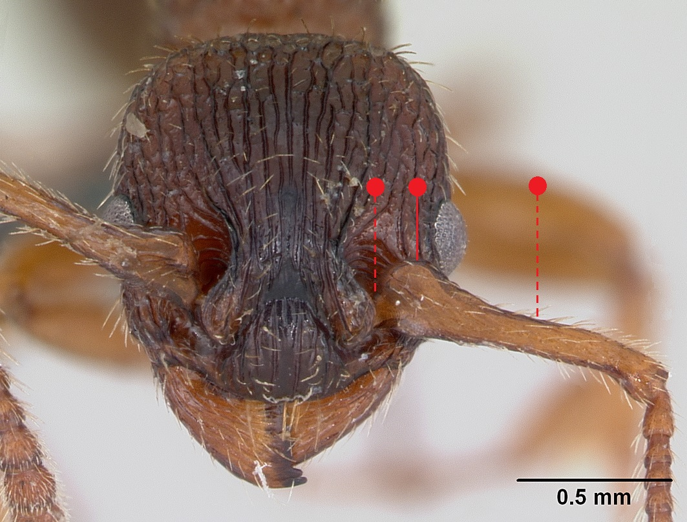
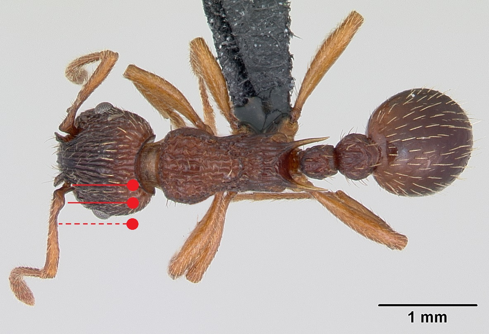
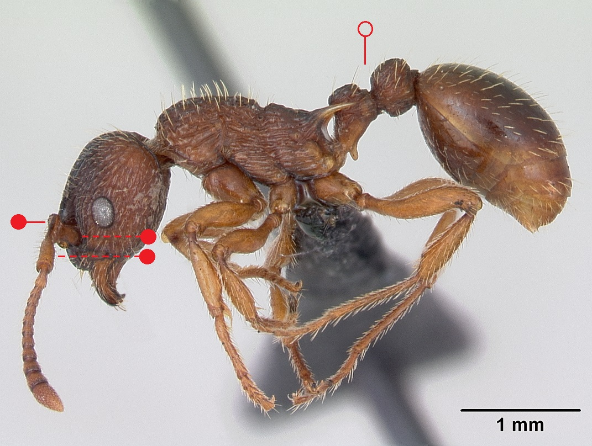
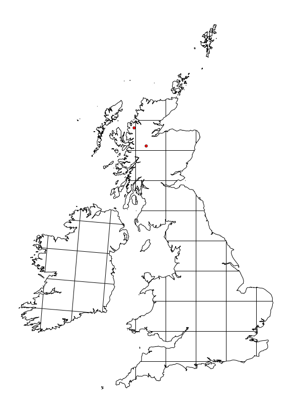

# **Myrmica lonae** Finzi, 1926

```{marginfigure}
```

```{r eval=TRUE, echo=FALSE, purl=FALSE, fig.margin = TRUE}

```

```{r eval=TRUE, echo=FALSE, purl=FALSE, fig.margin = TRUE}

```

```{r eval=TRUE, echo=FALSE, purl=FALSE}

```

```{block, type="attribution"}
Photos by April Nobile / From www.antweb.org. Accessed 12 October 2016.
Image Copyright © AntWeb 2002 - 2016. Licensing: Creative Commons Attribution License.
```

## Worker
Member of *Myrmicinae* with two segments to waist and sting present.

Like *Myrmica sabuleti* [antennal scape](#glossary) angled with ball and socket joint on different axis with [scape process ](#glossary) slightly rotated and [scape](#glossary) with flange running along the shaft near the base but flange is larger and wider [@Seifert-2000].

## Nest
Under stones in more shady, cooler and humid areas than *Myrmica sabuleti*, with few hundred workers. Pupae naked.

```{r eval=TRUE, echo=FALSE, purl=FALSE, fig.margin = TRUE}

```
`r margin_note("Data courtesy of the NBN Gateway and provided by BWARS.")`
`r margin_note("Crown copyright and database rights 2011 Ordnance Survey [100017955].")`

## Alates
Mating flight occurs in August to September. Males have long [scape](#glossary), similar to *Myrmica sabuleti*.

\pagebreak