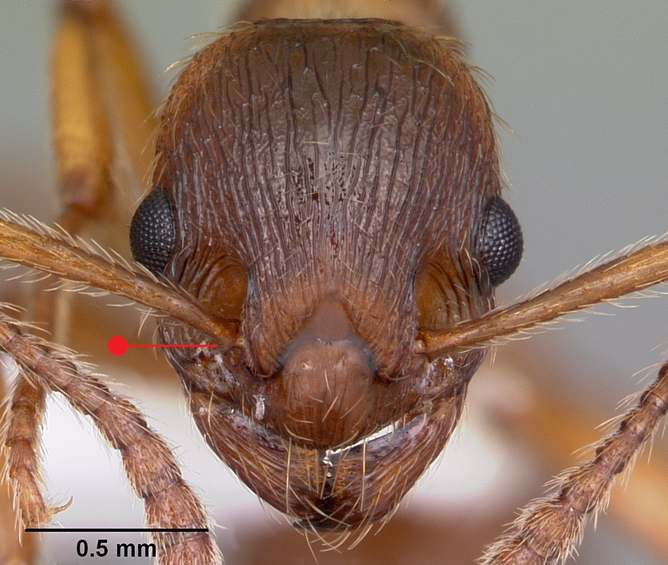

# **Myrmica rubra** (Linnaeus, 1758)

```{marginfigure}
```

```{r eval=TRUE, echo=FALSE, purl=FALSE, fig.margin = TRUE}

```

```{r eval=TRUE, echo=FALSE, purl=FALSE, fig.margin = TRUE}

```

```{r eval=TRUE, echo=FALSE, purl=FALSE}

```

```{block, type="attribution"}
Photos by April Nobile / From www.antweb.org. Accessed 28 September 2016.
Image Copyright © AntWeb 2002 - 2016. Licensing: Creative Commons Attribution License.
```


## Worker
Member of *Myrmicinae* with two segments to waist and sting present.

Like *Myrmica ruginodis* and *Myrmica sulcinodis* [antennal scape](#glossary) curved with ball and socket joint on same axis but [propodeal spines](#glossary) are short with smooth base and upper surface of [petiole](#glossary) curved into hind face.

Aggressive general scavenger and predator on invertebrates, aphid honeydew and flower nectar, often seen foraging on tall herbs.

## Nest
In soil, rotting tree stumps and under stones of damp, open non-flooding sites such as meadows and river banks, open urban, agricultural areas, woodland edges, parks and gardens. Nest contains multiple queens with hundreds of workers and may be formed by colony fission. Pupae naked.

```{r eval=TRUE, echo=FALSE, purl=FALSE, fig.margin = TRUE}
knitr::include_graphics("images//Myrmica_rubra//Myrmica_rubra_map.png")
```
`r margin_note("Data courtesy of the NBN Gateway and provided by BWARS.")`
`r margin_note("Crown copyright and database rights 2011 Ordnance Survey [100017955].")`

## Alates
Mating swarms in August and September. Queens vary in size ^[microgynous or macrogynous queens]. Unlike *Myrmica ruginodis* males with long sub-erect hairs on [posterior tibiae](#glossary).

\pagebreak