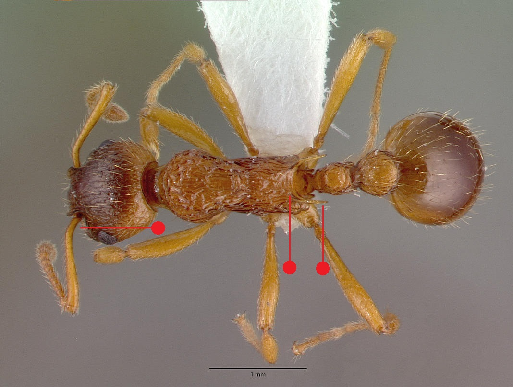

# **Myrmica ruginodis** Nylander, 1846

```{marginfigure}
```

```{r eval=TRUE, echo=FALSE, purl=FALSE, fig.margin = TRUE}

```

```{r eval=TRUE, echo=FALSE, purl=FALSE, fig.margin = TRUE}

```

```{r eval=TRUE, echo=FALSE, purl=FALSE}
knitr::include_graphics("images//Myrmica_ruginodis//Myrmica_ruginodis_side.jpg")
```

```{block, type="attribution"}
Photos from www.antweb.org. Accessed 28 September 2016.
Image Copyright © AntWeb 2002 - 2016. Licensing: Creative Commons Attribution License.
```

## Identification
Member of *Myrmicinae* with **two segments to waist** and **sting present**. Pupae naked.

Like *Myrmica rubra* and *Myrmica sulcinodis* **antennal scape curved with ball and socket joint on same axis** but propodeal **spines are long and divergent** with **transverse furrows on base** and **upper surface of petiole angled into hind face**. Queens vary in size. ^[Two incompletely dimorphic races with microgynous or macrogynous queens]. Unlike *Myrmica rubra* males with **short adpressed hairs on posterior tibiae**.

## Nest
Shade tolerant, in soil of open wet ground and among grass tussocks on acid moors and grasslands and in dead wood lying on ground or in rotten tree stumps in woodlands. New nests formed by either colony fussion containing multiple small queens with hundreds of workers or by single large queens dispersing to new habitat.

```{r eval=TRUE, echo=FALSE, purl=FALSE, fig.margin = TRUE}

```
`r margin_note("Data courtesy of the NBN Gateway and provided by BWARS.")`
`r margin_note("Crown copyright and database rights 2011 Ordnance Survey [100017955].")`

## Workers
Predator on small invertebrates and tends aphids.

## Alates
Mating swarms in August and September.

\pagebreak