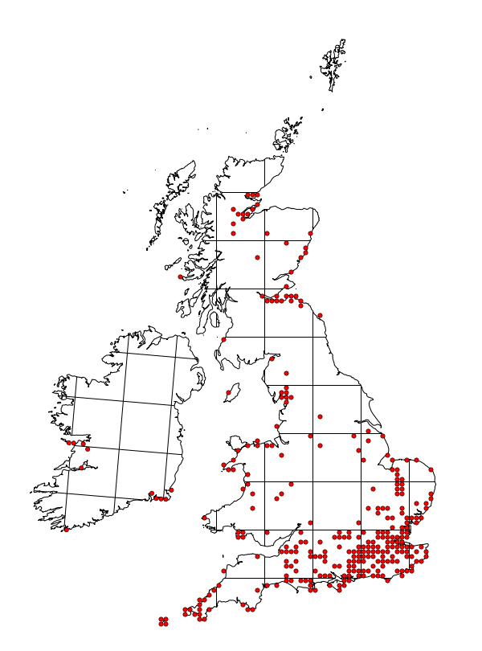

# **Myrmica sabuleti** Meinert, 1861

```{marginfigure}
```

```{r eval=TRUE, echo=FALSE, purl=FALSE, fig.margin = TRUE}
knitr::include_graphics("images//Myrmica_sabuleti//Myrmica_sabuleti_head.jpg")
```

```{r eval=TRUE, echo=FALSE, purl=FALSE}
knitr::include_graphics("images//Myrmica_sabuleti//Myrmica_sabuleti_side.jpg")
```

```{block, type="attribution"}
Photos by Noel Tawatao / From www.antweb.org. Accessed 3 October 2016
Image Copyright © AntWeb 2002 - 2016. Licensing: Creative Commons Attribution License.
```

## Worker
Member of *Myrmicinae* with **two segments to waist** and **sting present**.

## Nest
Pupae naked.

```{r eval=TRUE, echo=FALSE, purl=FALSE, fig.margin = TRUE}

```
`r margin_note("Data courtesy of the NBN Gateway and provided by BWARS.")`
`r margin_note("Crown copyright and database rights 2011 Ordnance Survey [100017955].")`

## Alates

\pagebreak