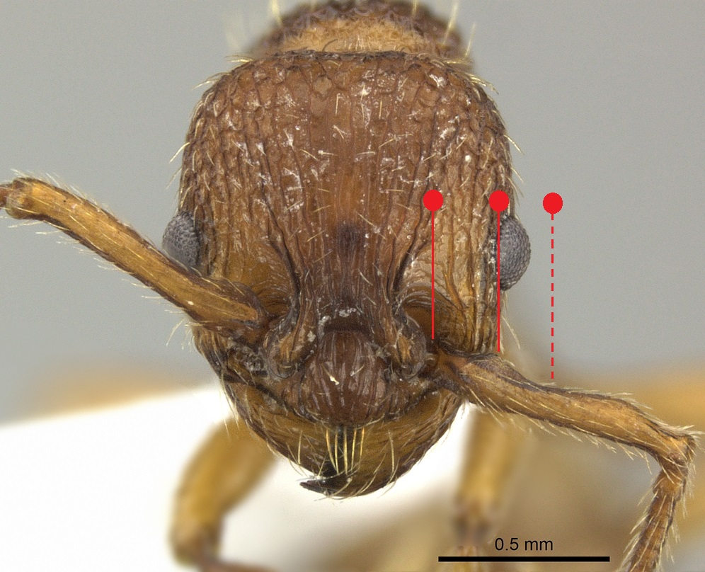

# **Myrmica sabuleti** Meinert, 1861

```{marginfigure}
```

```{r eval=TRUE, echo=FALSE, purl=FALSE, fig.margin = TRUE}

```

```{r eval=TRUE, echo=FALSE, purl=FALSE}

```

```{block, type="attribution"}
Photos by Noel Tawatao / From www.antweb.org. Accessed 3 October 2016
Image Copyright © AntWeb 2002 - 2016. Licensing: Creative Commons Attribution License.
```

## Worker
Member of *Myrmicinae* with **two segments to waist** and **sting present**.

Like *Myrmica specioides* **antennal scape angled with ball and socket joint on different axis** with **scape process slightly rotated**. Unlike *Myrmica scabrinodis* **antennal scape with flange running along the shaft near the base**. **Petiole front surface curved into top face**.

General predator and scavenger as well as tends smalling groups of aphids especially base of stems at ground level.

## Nest
Under stones, with few hundred workers in hot dry parts of chalk downs and sandy heaths, where it requires some grazing or burning to maintain bare patches, seldom in tree stumps or boggy land. May replace *Myrmica scabrinodes*, *Lasius alienus* or *Lasius psammophilus* and is replaced by *Myrmica schenki* and *Myrmica specioides* in hotter areas. Parasitised by *Myrmica karavajevi* and *Myrmica hirsuta* when continues to produce workers but no alates. Pupae naked.

```{r eval=TRUE, echo=FALSE, purl=FALSE, fig.margin = TRUE}
knitr::include_graphics("images//Myrmica_sabuleti//Myrmica_sabuleti_map.png")
```
`r margin_note("Data courtesy of the NBN Gateway and provided by BWARS.")`
`r margin_note("Crown copyright and database rights 2011 Ordnance Survey [100017955].")`

## Alates
Mating flights occur from August to the end of September. Unlike *Myrmica scabrinodis* male have **long antennal scapes**.

\pagebreak