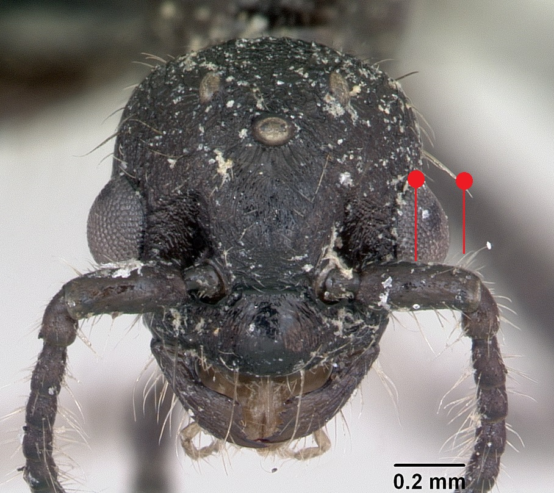
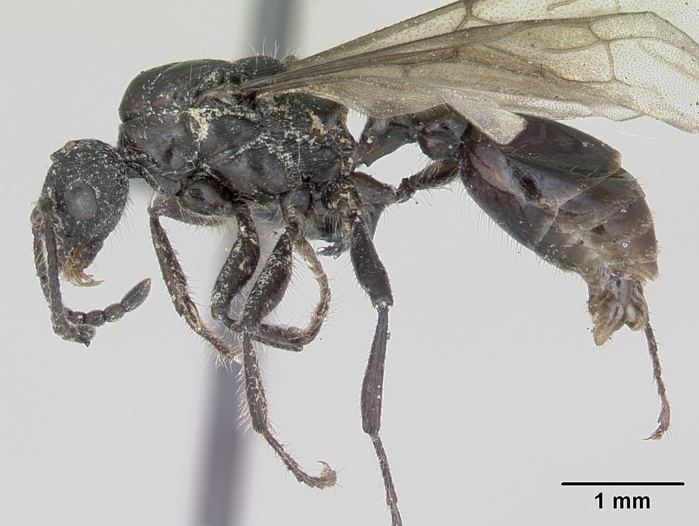
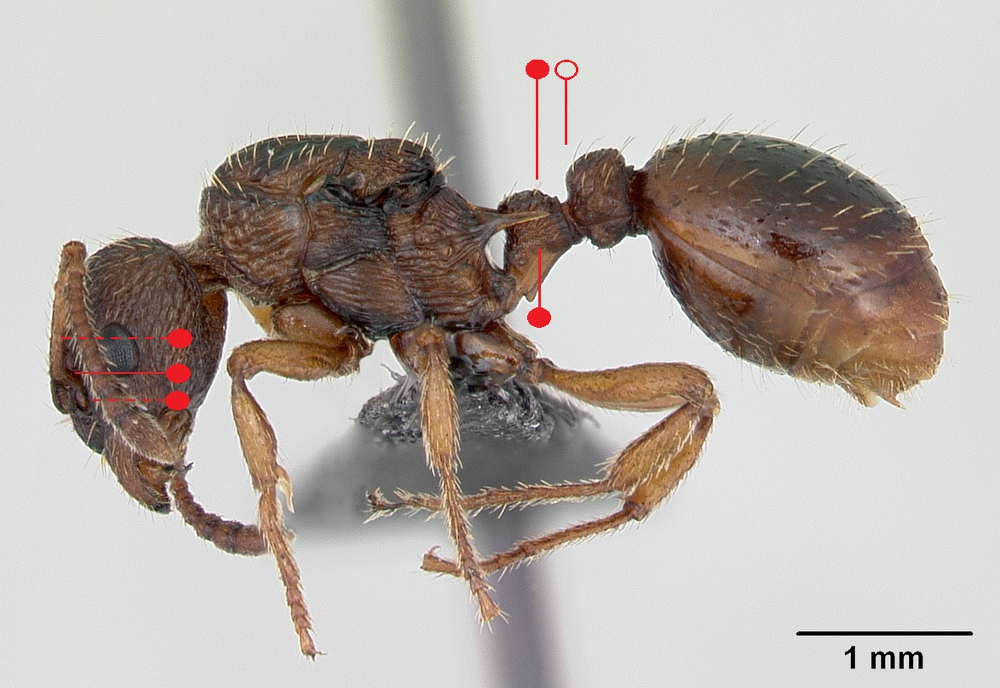
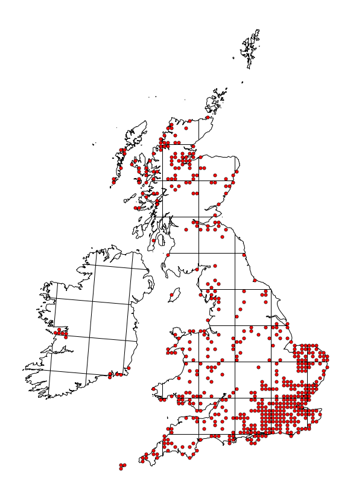

# **Myrmica scabrinodis**  Nylander, 1846

```{marginfigure}
```

```{r eval=TRUE, echo=FALSE, purl=FALSE, fig.margin = TRUE}
knitr::include_graphics("images//Myrmica_scabrinodis//Myrmica_scabrinodis_head.jpg")
```

```{r eval=TRUE, echo=FALSE, purl=FALSE, fig.margin = TRUE}

```

```{r eval=TRUE, echo=FALSE, purl=FALSE, fig.margin = TRUE}

```

```{r eval=TRUE, echo=FALSE, purl=FALSE}

```

```{block, type="attribution"}
Photos (worker and male) by April Nobile / From www.antweb.org. Accessed 3 October 2016
Image Copyright © AntWeb 2002 - 2016. Licensing: Creative Commons Attribution License.
```

## Identification
Member of *Myrmicinae* with **two segments to waist** and **sting present**. Pupae naked.

Like *Myrmica vandeli* **antennal scape angled with ball and socket joint on different axis** with **process rotated about 45 degrees** though less hairy than this species. Unlike *Myrmica sabuelti* **antennal scape only has narrow longitudinal ridge or flange at most**. **Petiole flat and truncate with upper surface angled into hind face**, **postpetiole rectangular**. Unlike *Myrmica vandeli* and *Myrmica sabuelti* males have **shorter scape** and unlike *Myrmica specioides* with **longer erect hairs**.

## Nest
Under stones, bare soil and tussocks in sunny sites that are not extremely dry, rural and suburban areas but absent from uncultivated arable farmland. Shares mounds with *Lasius flavus*. Nests formed by single queens foraging to rear few small workers in the following year that then increases to few hundred workers. Parasitised by *Myrmica karavajevi* when continues to produce workers but no alates.

```{r eval=TRUE, echo=FALSE, purl=FALSE, fig.margin = TRUE}

```
`r margin_note("Data courtesy of the NBN Gateway and provided by BWARS.")`
`r margin_note("Crown copyright and database rights 2011 Ordnance Survey [100017955].")`

## Workers

## Alates
Mating flights in July

\pagebreak