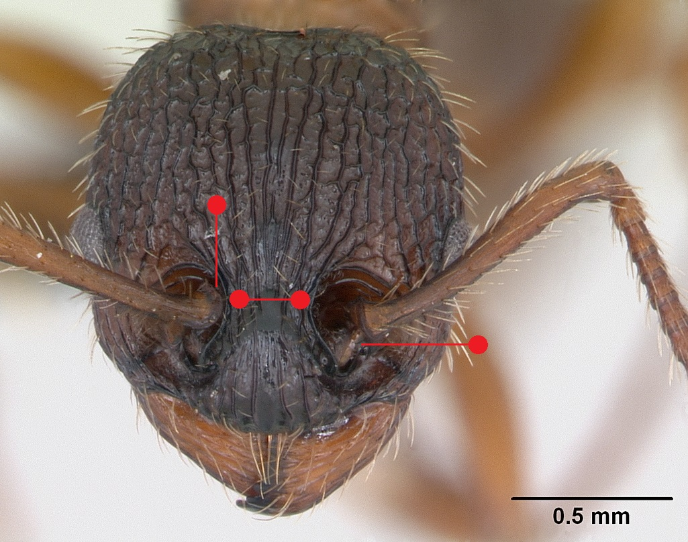
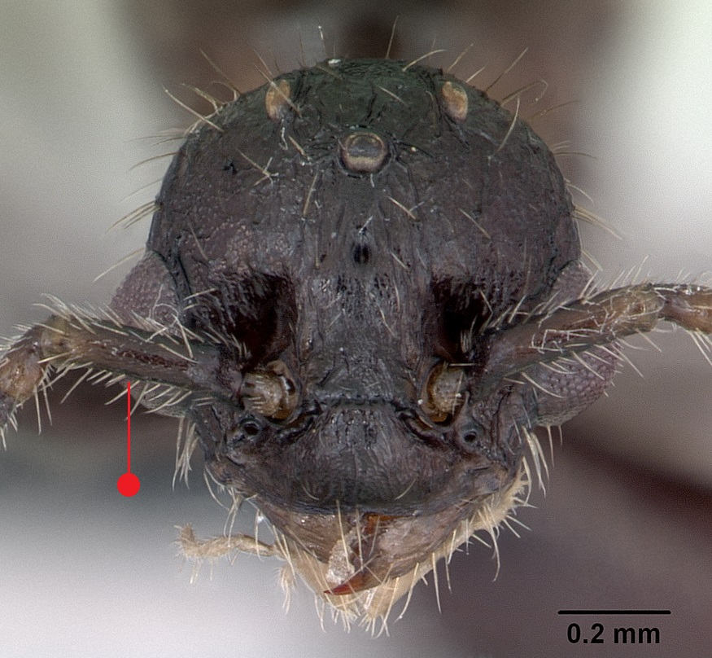
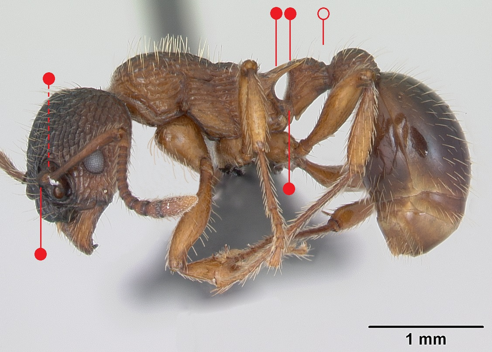
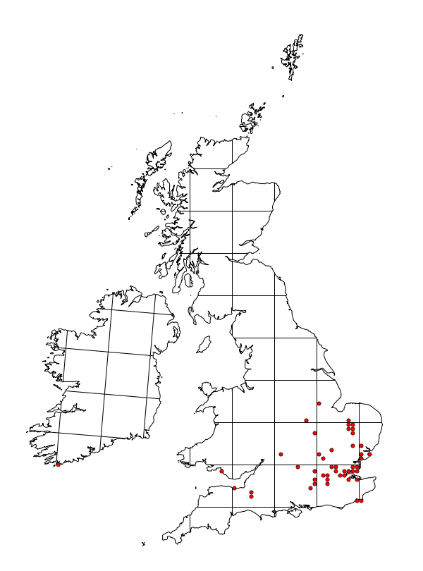

# **Myrmica schencki** Emery, 1895

```{marginfigure}
```

```{r eval=TRUE, echo=FALSE, purl=FALSE, fig.margin = TRUE}

```

```{r eval=TRUE, echo=FALSE, purl=FALSE, fig.margin = TRUE}

```

```{r eval=TRUE, echo=FALSE, purl=FALSE}

```

```{block, type="attribution"}
Photos (worker and male) by April Nobile / From www.antweb.org. Accessed 11 October 2016.
Image Copyright © AntWeb 2002 - 2016. Licensing: Creative Commons Attribution License.
```

## Worker
Member of *Myrmicinae* with **two segments to waist** and **sting present**.

**Antennal scape angled with ball and socket joint on different axis** and **scale like flange around the shaft close to the base**. Unlike *Myrmica lobicornis* **frons narrow, one quarter width of head**, narrower than antennae to edge of outer head as well as **petiole with well developed peduncle** and **front surface obtusely angled into top face**. **Propodeal spines long and slender**.

Nocturnal predator of invertebrates and among aphids on tall herbs and shrubs.

## Nest
Usually in soil in hottest dry sites on chalk downs and sunny sites on heathland and grassland. Single queens with few hundred workers. Pupae naked.

```{r eval=TRUE, echo=FALSE, purl=FALSE, fig.margin = TRUE}

```
`r margin_note("Data courtesy of the NBN Gateway and provided by BWARS.")`
`r margin_note("Crown copyright and database rights 2011 Ordnance Survey [100017955].")`

## Alates
Mating flight occurring in August. Unlike *Myrmica lobicornis* males have **short scapes**.

\pagebreak