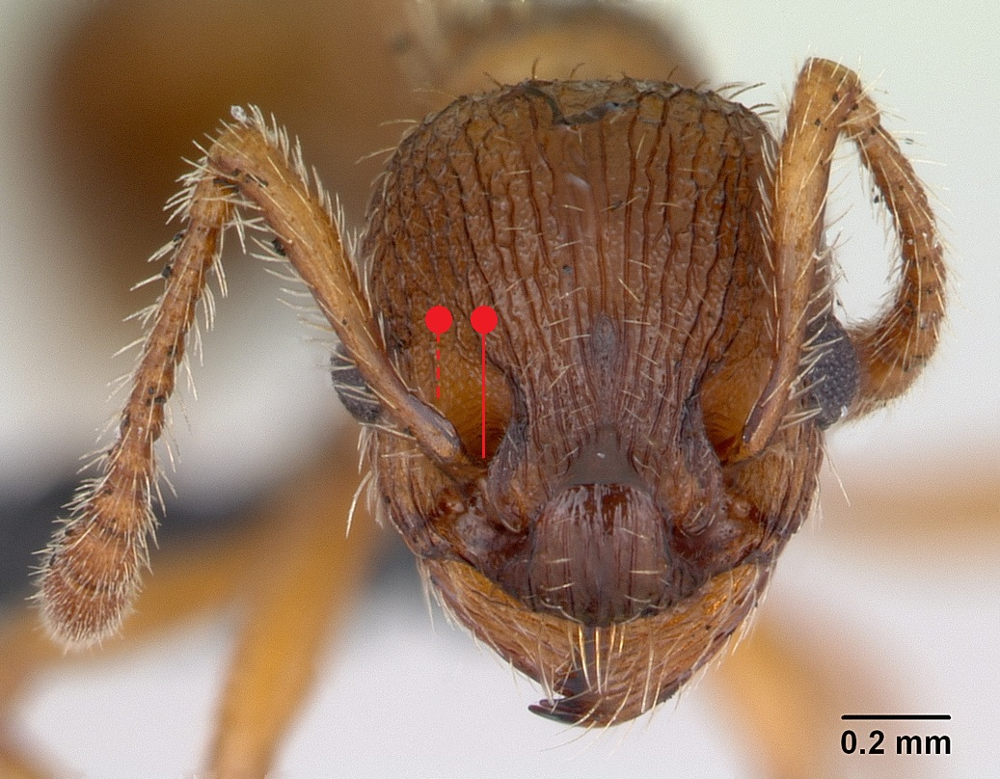
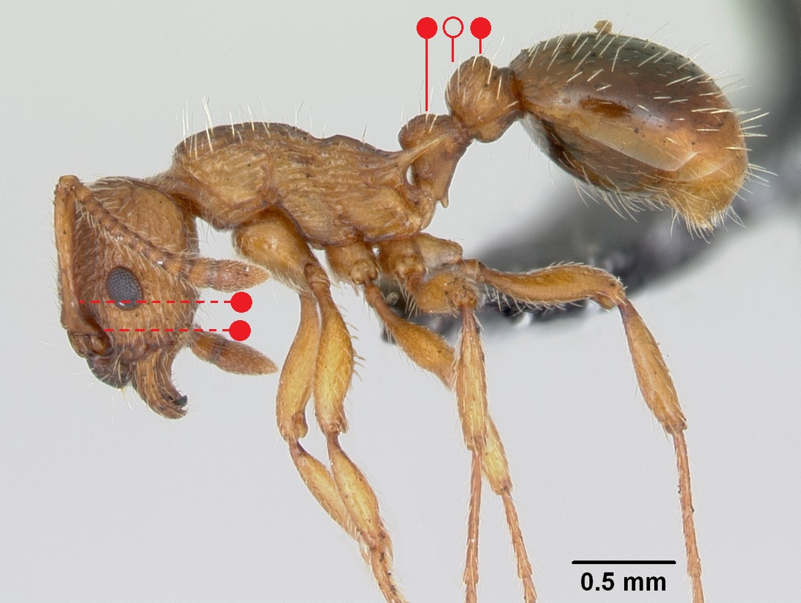

# **Myrmica specioides** Bondroit, 1918

```{marginfigure}
```

```{r eval=TRUE, echo=FALSE, purl=FALSE, fig.margin = TRUE}

```

```{r eval=TRUE, echo=FALSE, purl=FALSE, fig.margin = TRUE}

```

```{r eval=TRUE, echo=FALSE, purl=FALSE}

```

```{block, type="attribution"}
Photos (worker and male) by April Nobile / From www.antweb.org. Accessed 3 October 2016
Image Copyright © AntWeb 2002 - 2016. Licensing: Creative Commons Attribution License.
```

## Worker
Member of *Myrmicinae* with **two segments to waist** and **sting present**.

Like *Myrmica sabuleti* **antennal scape angled with ball and socket joint on different axis** with **scape process slightly rotated**. **Upper surface of petiole curved into hind face** and **postpetiole almost spherical**.

Aggressive stinging ant predating on workers and brood of *Lasius flavus*.

## Nest
Hot and dry coastal sand and gravel banks with simple entrance hole. Colonies have one to several queens with ten to few hundred workers. Pupae naked.

```{r eval=TRUE, echo=FALSE, purl=FALSE, fig.margin = TRUE}
knitr::include_graphics("images//Myrmica_specioides//Myrmica_specioides_map.png")
```
`r margin_note("Data courtesy of the NBN Gateway and provided by BWARS.")`
`r margin_note("Crown copyright and database rights 2011 Ordnance Survey [100017955].")`

## Alates
Mating flights occur late July to early September. Unlike *Myrmica sabuleti* and *Myrmica vandeli* males have **short antennal scapes** and unlike *Myrmica scabrinodis* with **short erect hairs to scape and legs**.

\pagebreak