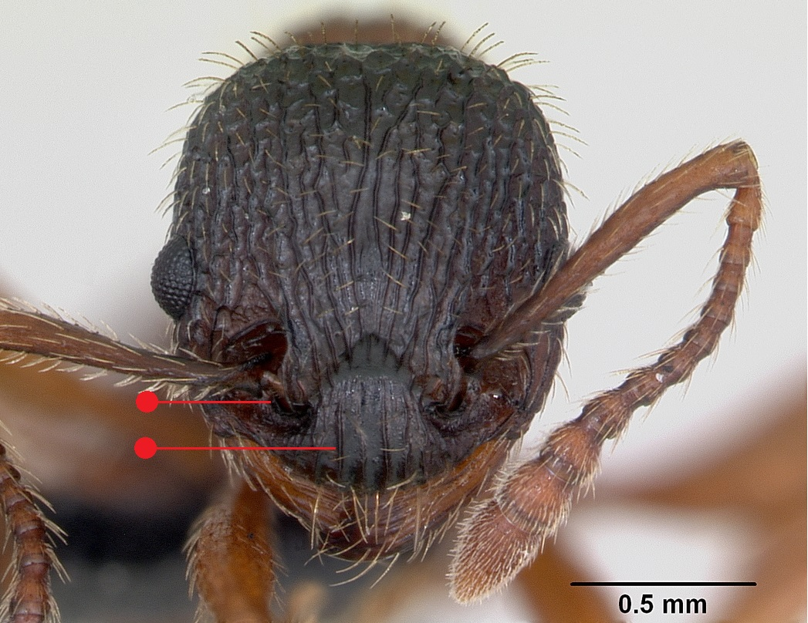

# **Myrmica sulcinodis** Nylander, 1846

```{marginfigure}
```

```{r eval=TRUE, echo=FALSE, purl=FALSE, fig.margin = TRUE}

```

```{r eval=TRUE, echo=FALSE, purl=FALSE, fig.margin = TRUE}
knitr::include_graphics("images//Myrmica_sulcinodis//Myrmica_sulcinodis_top.jpg")
```

```{r eval=TRUE, echo=FALSE, purl=FALSE}
knitr::include_graphics("images//Myrmica_sulcinodis//Myrmica_sulcinodis_side.jpg")
```

```{block, type="attribution"}
Photos by April Nobile / From www.antweb.org. Accessed 28 September 2016.
Image Copyright © AntWeb 2002 - 2016. Licensing: Creative Commons Attribution License.
```

## Worker
Member of *Myrmicinae* with two segments to waist and sting present.

Like *Myrmica rubra* and *Myrmica ruginodis* [antennal scape](#glossary) curved with ball and socket joint on same axis but workers larger, bicoloured with darker head and [gaster](#glossary) and more rugose, with heavily sculptured sides and sculptured frontal triangle with upright raised ridges. [Propodeal spines](#glossary) are long and parallel with convergent tips with transverse furrows on base. [Petiole](#glossary) without a distinct [peduncle](#glossary), having a steep anterior face.

Scavenger and predator on invertebrates.

## Nest
In peaty humps, under stones or in clumps of sun exposed peat in sparsely vegetated wet upland or lowland heaths, intolerant of successional change to tall heather or dense *Molinia* grass. Nest often with single queen and around one hundred workers but can contain multiple queens. Pupae naked (@Elmes-1987).

```{r eval=TRUE, echo=FALSE, purl=FALSE, fig.margin = TRUE}
knitr::include_graphics("images//Myrmica_sulcinodis//Myrmica_sulcinodis_map.png")
```
`r margin_note("Data courtesy of the NBN Gateway and provided by BWARS.")`
`r margin_note("Crown copyright and database rights 2011 Ordnance Survey [100017955].")`

## Alates
Mating swarms in August and early September.

\pagebreak