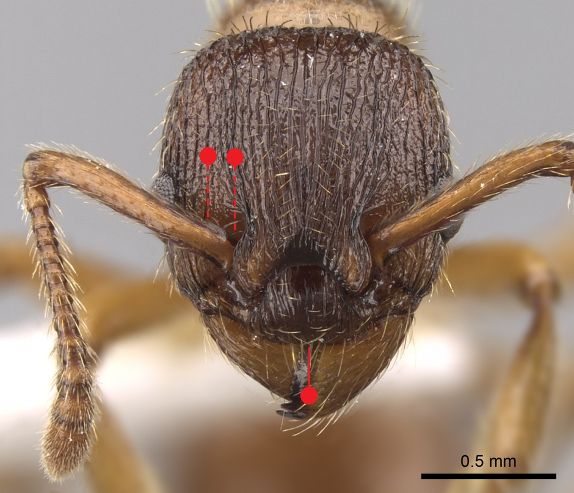
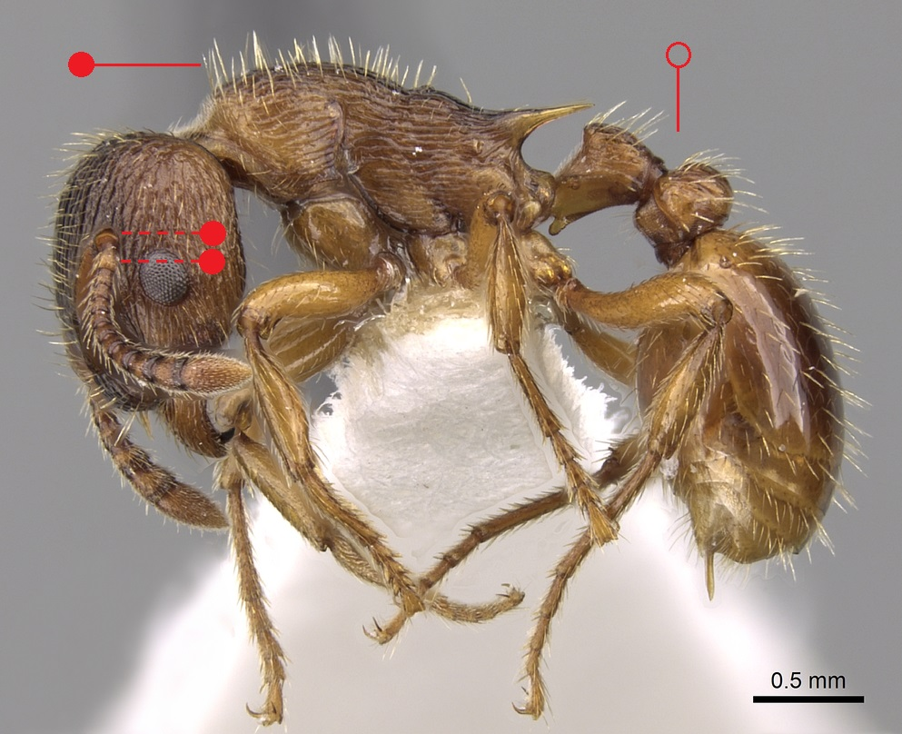

# **Myrmica vandeli** Bondroit, 1920

```{marginfigure}
```

```{r eval=TRUE, echo=FALSE, purl=FALSE, fig.margin = TRUE}

```

```{r eval=TRUE, echo=FALSE, purl=FALSE, fig.margin = TRUE}

```

```{r eval=TRUE, echo=FALSE, purl=FALSE}

```

```{block, type="attribution"}
Photos by Shannon Hartman (worker) and Zach Lieberman (male) / From www.antweb.org. Accessed 3 October 2016
Image Copyright © AntWeb 2002 - 2016. Licensing: Creative Commons Attribution License.
```

## Worker
Member of *Myrmicinae* with two segments to waist and sting present.

Like *Myrmica scabrinodis* **[antennal scape](#glossary)** angled with ball and socket joint on different axis with **[scape process ](#glossary)** rotated about 45 degrees though more hairy than this species. Anterior border of **[clypeus](#glossary)** with shallow concavity.

## Nest
Warm moist habitats in moss, grass and sedge tussocks of wet meadows, marshes and bogs, often with ten to hundreds of workers coexisting with *Myrmica scabrinodis*. Pupae naked.

```{r eval=TRUE, echo=FALSE, purl=FALSE, fig.margin = TRUE}

```
`r margin_note("Data courtesy of the NBN Gateway and provided by BWARS.")`
`r margin_note("Crown copyright and database rights 2011 Ordnance Survey [100017955].")`

## Alates
Unlike *Myrmica scabrinodis* and *Myrmica specioides* males have long **[scape](#glossary)**.

\pagebreak