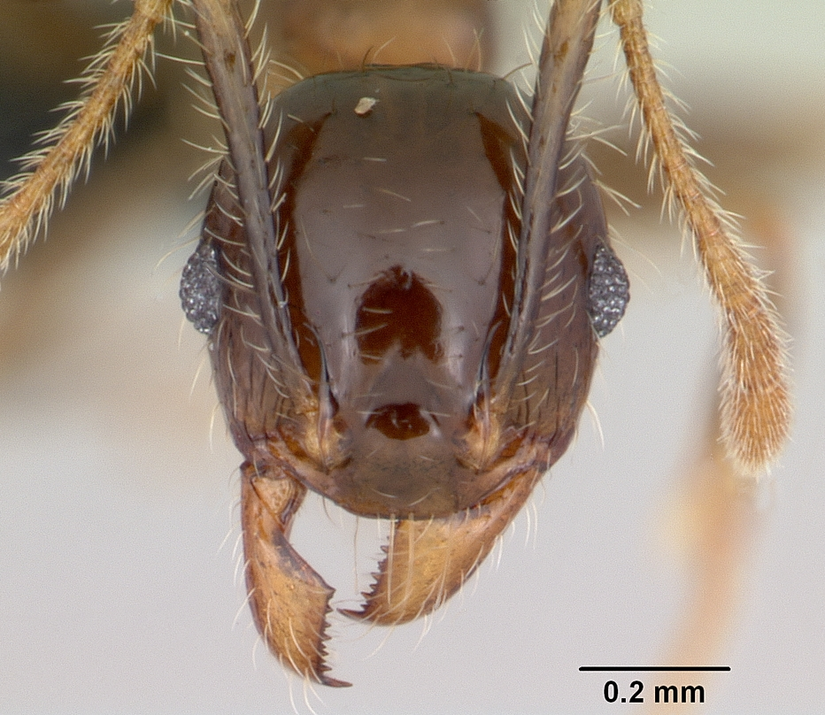
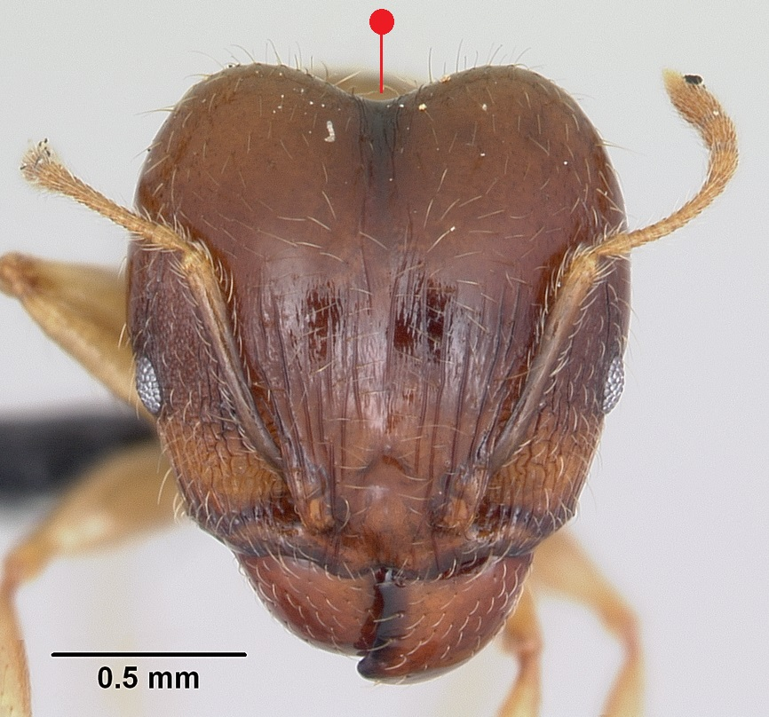
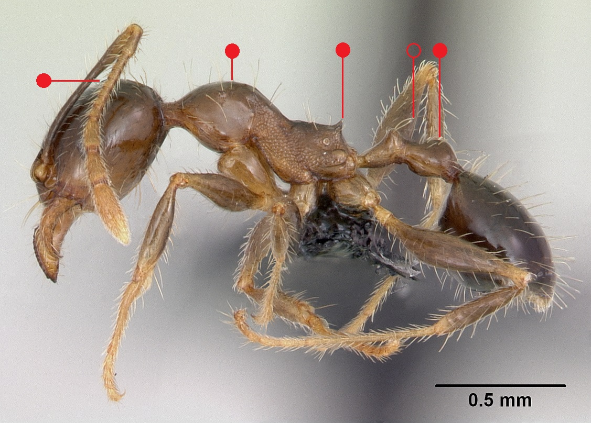

# **Pheidole megacephala** (Fabricius, 1793)

```{marginfigure}
```

```{r eval=TRUE, echo=FALSE, purl=FALSE, fig.margin = TRUE}
knitr::include_graphics("images//labels//tramp.png")
```

```{r eval=TRUE, echo=FALSE, purl=FALSE, fig.margin = TRUE}

```

```{r eval=TRUE, echo=FALSE, purl=FALSE, fig.margin = TRUE}

```

```{r eval=TRUE, echo=FALSE, purl=FALSE}

```
```{block, type="attribution"}
Photos (minor and major workers) by April Nobile / From www.antweb.org. Accessed 6 December 2016.
Image Copyright © AntWeb 2002 - 2016. Licensing: Creative Commons Attribution License.
```

## Worker
Introduced member of subfamily *Myrmicinae* with two segments to waist and sting present.

Aggressive species, workers dimorphic with two subcastes, major caste with large heart shaped head and minor caste with small ovoid head. [Mesosoma](#glossary) circular with short [propodeal spines](#glossary). [Postpetiole](#glossary) of minor workers ovoid to bell-shaped.

Predator, scavenger and attends Hemiptera for honey dew.

## Nest
In tropical and subtropical regions form large supercolonies with many queens in rotting logs, underneath rocks and pavements in relatively moist and disturbed open habitats with weedy vegetation supporting Hemiptera. Occurs indoors in Britain with no established colonies reported since 1970s. Pupae naked (@Wetterer-2012).

```{r eval=TRUE, echo=FALSE, purl=FALSE, fig.margin = TRUE}

```
`r margin_note("Data courtesy of the NBN Gateway and provided by BWARS.")`
`r margin_note("Crown copyright and database rights 2011 Ordnance Survey [100017955].")`

\pagebreak