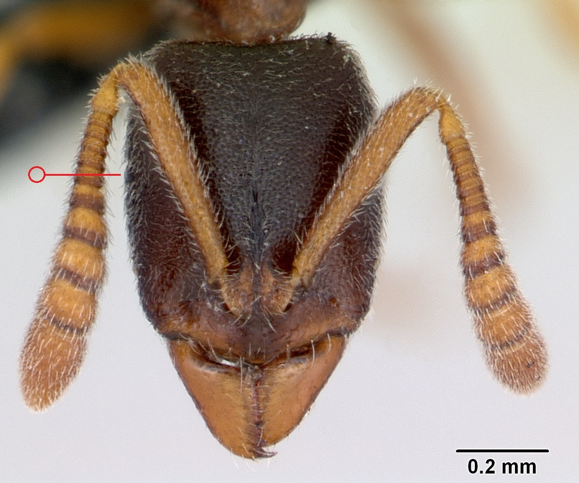

# **Ponera coarcta** (Latreille, 1802)

```{marginfigure}
```

```{r eval=TRUE, echo=FALSE, purl=FALSE, fig.margin = TRUE}

```

```{r eval=TRUE, echo=FALSE, purl=FALSE}

```
```{block, type="attribution"}
Photos by April Nobile / From www.antweb.org. Accessed 17 September 2016.
Image Copyright © AntWeb 2002 - 2016. Licensing: Creative Commons Attribution License.
```

## Worker
Member of subfamily *Ponerinae* with **single thick waisted segment**, **constriction between first and second gaster segments** and **well developed sting**. Head with **minute eyes**.

Unlike *Hypoponera punctatissima* **coarsely punctured** with **backward pointing projection on underside of petiole**.

Sluggish, mainly subterranean predator on developmental stages of underground invertebrates. Found in or close to other ant nests, often with *Myrmecina graminicola*. Collected using mince meat baits and sieving moss.

## Nest
Very small tunnels through soil, beneath stones with few workers and a single queen. Nest in hot sites which do not dry out, clay on chalk downs, open stony ground, grassland, crumbling cliffs and open woodland, waste ground, scrub and large urban gardens. Pupae enclosed in cocoons.

```{r eval=TRUE, echo=FALSE, purl=FALSE, fig.margin = TRUE}

```
`r margin_note("Data courtesy of the NBN Gateway and provided by BWARS.")`
`r margin_note("Crown copyright and database rights 2011 Ordnance Survey [100017955].")`

## Alates
Mating flights in August and September. Male **winged** with **13 antennal segments** and **spine on [pygidium](#glossary)**.

\pagebreak