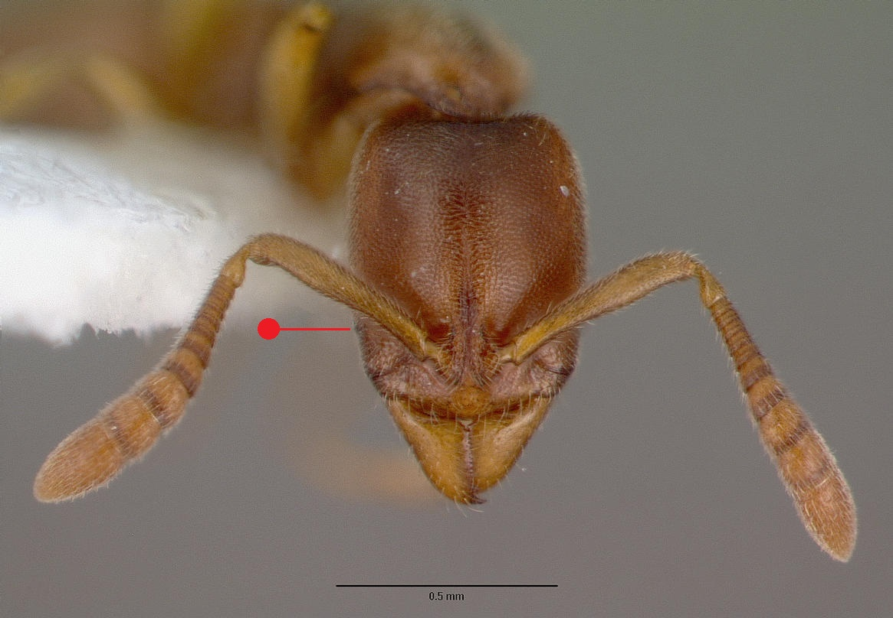
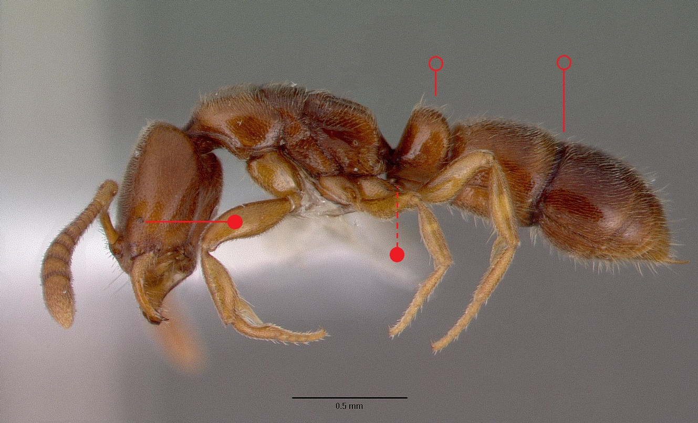

# **Ponera testacea** Emery, 1895

```{marginfigure}
```

```{r eval=TRUE, echo=FALSE, purl=FALSE, fig.margin = TRUE}

```

```{r eval=TRUE, echo=FALSE, purl=FALSE}

```
```{block, type="attribution"}
Photos by / From www.antweb.org. Accessed 22 November 2016
Image Copyright © AntWeb 2002 - 2016. Licensing: Creative Commons Attribution License.
```

## Worker
Member of subfamily *Ponerinae* with single thick waisted segment, constriction between first and second [gaster](#glossary) segments and well developed sting. Head with minute eyes.

Unlike *Hypoponera punctatissima* [subpetiolar process](#glossary) present. Brownish-yellow rather than the darker brown *Ponera coarctata* and differing by a number of morphometric measurements of the first [gaster tergite](#glossary), [petiole](#glossary) and [frons](#glossary)^[not in glossary] (@Attewell-2010; @Csosz-2003).

## Nest
In drier and hotter, more sparsely vegetated habitats than *Ponera coarctata*, avoiding shaded, moister woodland habitats. Pupae enclosed in cocoons.

```{r eval=TRUE, echo=FALSE, purl=FALSE, fig.margin = TRUE}
knitr::include_graphics("images//Ponera_testacea//Ponera_testacea_map.png")
```
`r margin_note("Data courtesy of the NBN Gateway and provided by BWARS.")`
`r margin_note("Crown copyright and database rights 2011 Ordnance Survey [100017955].")`

\pagebreak