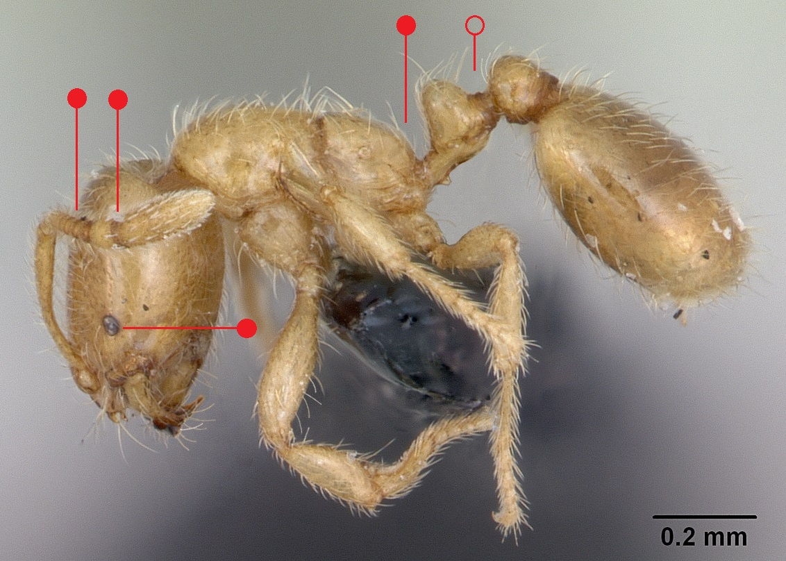

# **Solenopsis fugax** (Latreille, 1798)

```{marginfigure}
```


```{r eval=TRUE, echo=FALSE, purl=FALSE, fig.margin = TRUE}

```

```{r eval=TRUE, echo=FALSE, purl=FALSE, fig.margin = TRUE}

```

```{r eval=TRUE, echo=FALSE, purl=FALSE}

```

```{block, type="attribution"}
Photos (worker and queen) by April Nobile / From www.antweb.org. Accessed 27 September 2016
Image Copyright © AntWeb 2002 - 2016. Licensing: Creative Commons Attribution License.
```

## Worker
Member of *Myrmicinae* with **two segments to waist** and **sting present**.

**Small eyes** with **ten segments to antennae** and **two segmented apical club**. **Propodeum rounded with no spines**.

Subterranean aggressive ant raiding broods of larger ants, eating their larvae and pupae, as well as tending aphids.

## Nest
Under deeply buried stones and rock clefts in coastal cliff where falls provide bare habitats, with colonies, consisting of numerous workers and multiple queens, often associated with *Lasius flavus* and *Formica* species. Nests formed from single queens or by nest budding. Pupae naked.

```{r eval=TRUE, echo=FALSE, purl=FALSE, fig.margin = TRUE}

```
`r margin_note("Data courtesy of the NBN Gateway and provided by BWARS.")`
`r margin_note("Crown copyright and database rights 2011 Ordnance Survey [100017955].")`

## Alates
Mating flights in September and October. Queens and males larger than workers, with queens having **eleven antennal segments** and males **twelve antennal segments**.

\pagebreak