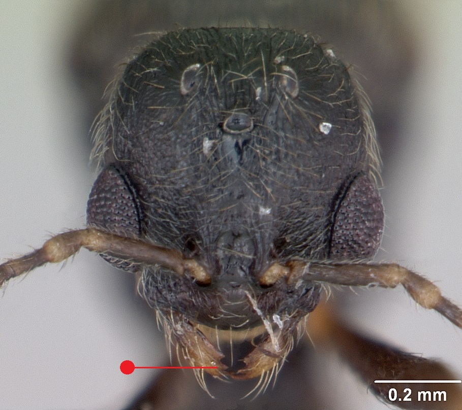

# **Stenamma debile** (Förster, 1850)

```{marginfigure}
```

```{r eval=TRUE, echo=FALSE, purl=FALSE, fig.margin = TRUE}
knitr::include_graphics("images//Stenamma_debile//Stenamma_debile_head.jpg")
```

```{r eval=TRUE, echo=FALSE, purl=FALSE, fig.margin = TRUE}

```

```{r eval=TRUE, echo=FALSE, purl=FALSE}

```
```{block, type="attribution"}
Photos by Erin Prado (worker) and April Nobile (male) / From www.antweb.org. Accessed 17 October 2016.
Image Copyright © AntWeb 2002 - 2016. Licensing: Creative Commons Attribution License.
```

## Worker
Member of *Myrmicinae* with two segments to waist and sting present.

Like *Stenamma westwoodii* small and slender ant, slow moving with small eyes, elongate [petiole](#glossary), small [propodeal spines](#glossary) and two ridges along middle portion of [clypeus](#glossary) but central smooth [frontal area](#glossary)^[not in glossary] greater than a third of the total width between antennal bases and legs shorter and stouter. ... [@Stenamma-1993]

Often seen singularly scavenging small invertebrates in leaf litter.

## Nest
Small nests, with one queen and around ten workers, under large deeply embedded stones, inside hollow flints, other buried cavities in total shade of old woodland and hedgerows. Pupae naked.

```{r eval=TRUE, echo=FALSE, purl=FALSE, fig.margin = TRUE}

```
`r margin_note("Data courtesy of the NBN Gateway and provided by BWARS.")`
`r margin_note("Crown copyright and database rights 2011 Ordnance Survey [100017955].")`

## Alates
Mating flights in September. Unlike *Stenamma westwoodii* males have three [mandibular teeth](#glossary)^[not in glossary].

\pagebreak