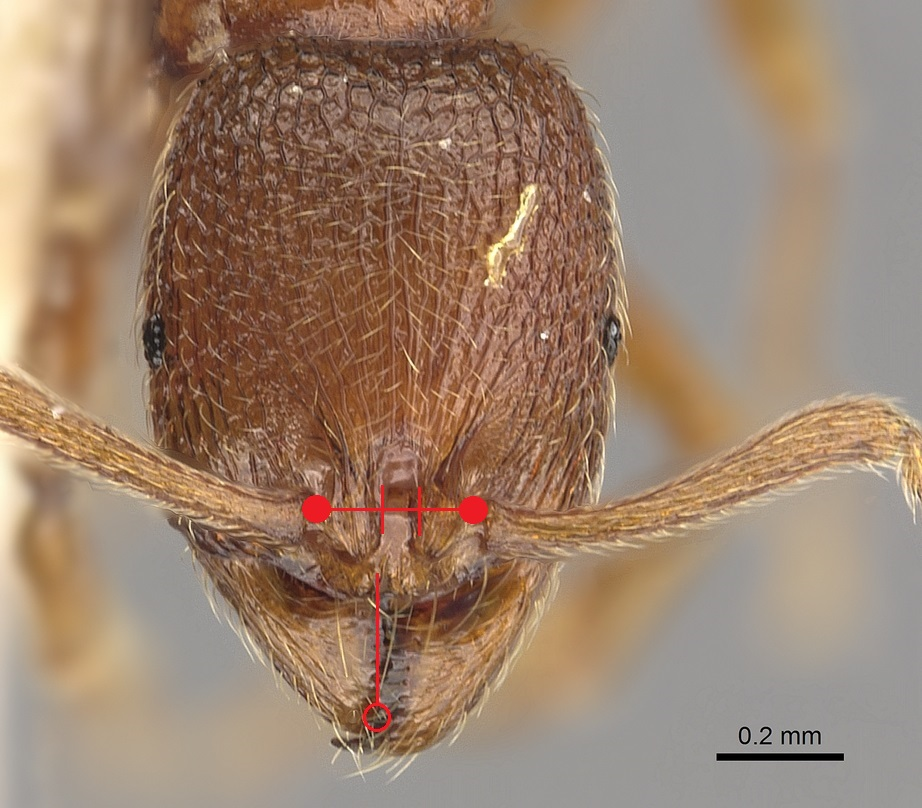

# **Stenamma westwoodii** Westwood, 1839

```{marginfigure}
```

```{r eval=TRUE, echo=FALSE, purl=FALSE, fig.margin = TRUE}

```

```{r eval=TRUE, echo=FALSE, purl=FALSE}
knitr::include_graphics("images//Stenamma_westwoodii//Stenamma_westwoodii_side.jpg")
```
```{block, type="attribution"}
Photos (worker and male) by Zach Lieberman / From www.antweb.org. Accessed 17 October 2016.
Image Copyright © AntWeb 2002 - 2016. Licensing: Creative Commons Attribution License.
```

## Worker
Member of *Myrmicinae* with **two segments to waist** and **sting present**.

Like *Stenamma debile* small and slender ant, slow moving with small eyes, **elongate petiole**, **small propodeal spines** and **two ridges along middle portion of clypeus** but **central smooth frontal area less than a third of the total width between antennal bases** and **legs longer and narrower**.

Scavenger of small invertebrates in leaf litter.

## Nest
Small nests, with around one hundred workers, under large deeply embedded stones, inside hollow flints, other buried cavities in total shade of old woodland and hedgerows. May prefer more open habitat than *Stenamma debile*. Pupae naked.

```{r eval=TRUE, echo=FALSE, purl=FALSE, fig.margin = TRUE}

```
`r margin_note("Data courtesy of the NBN Gateway and provided by BWARS.")`
`r margin_note("Crown copyright and database rights 2011 Ordnance Survey [100017955].")`

## Alates
Mating flights in October. . Unlike *Stenamma debile* males have **five mandibular teeth**.

\pagebreak