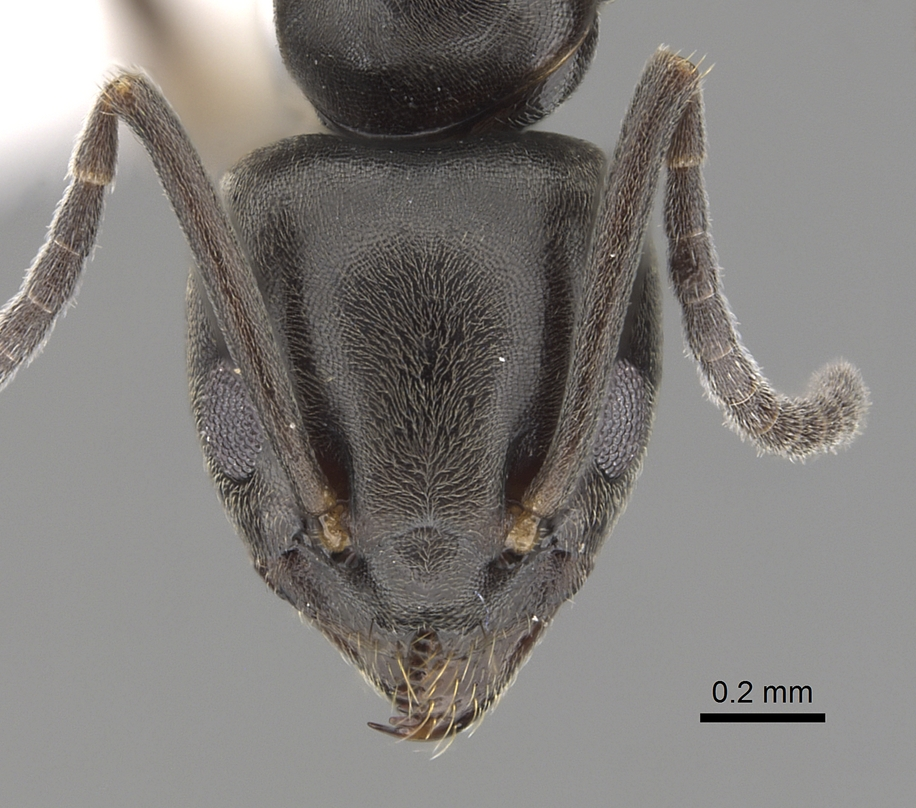
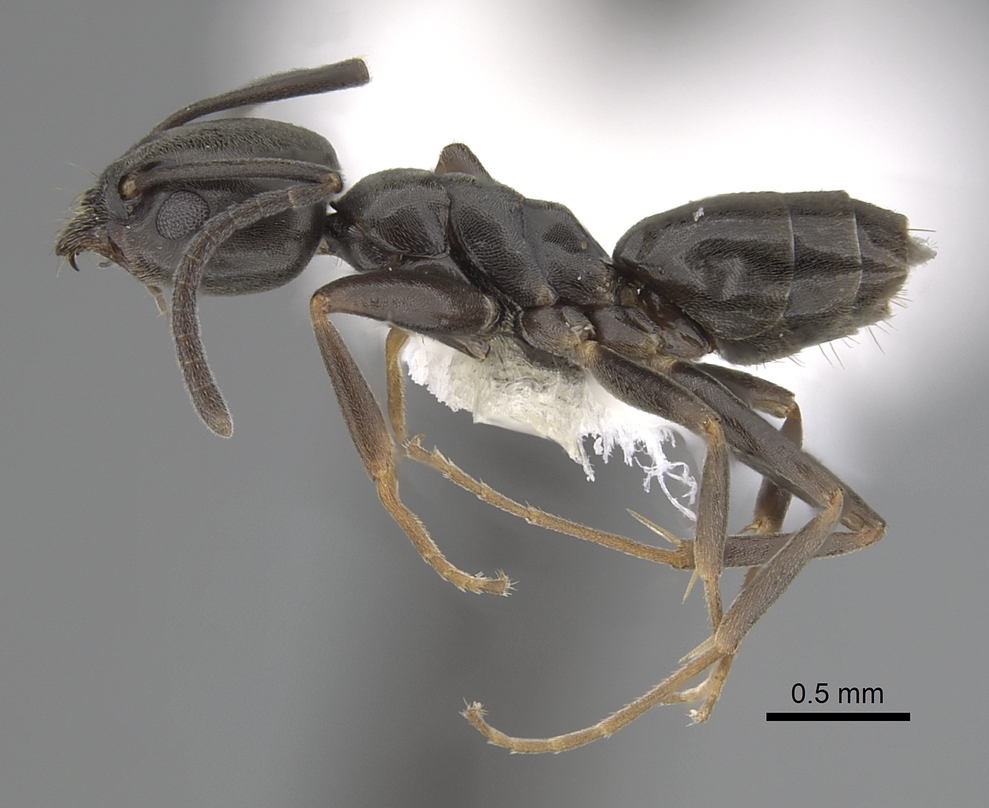

# **Tapinoma erraticum** (Latreille, 1798)

```{marginfigure}
```

```{r eval=TRUE, echo=FALSE, purl=FALSE, fig.margin = TRUE}

```

```{r eval=TRUE, echo=FALSE, purl=FALSE}

```

```{block, type="attribution"}
Photos by Shannon Hartman / From www.antweb.org. Accessed 6 January 2017
Image Copyright © AntWeb 2002 - 2016. Licensing: Creative Commons Attribution License.
```


## Worker
Member of subfamily *Dolichoderinae* with waist hidden under gaster and sting absent.

## Nest
Pupae naked.

```{r eval=TRUE, echo=FALSE, purl=FALSE, fig.margin = TRUE}

```
`r margin_note("Data courtesy of the NBN Gateway and provided by BWARS.")`
`r margin_note("Crown copyright and database rights 2011 Ordnance Survey [100017955].")`

## Alates

\pagebreak