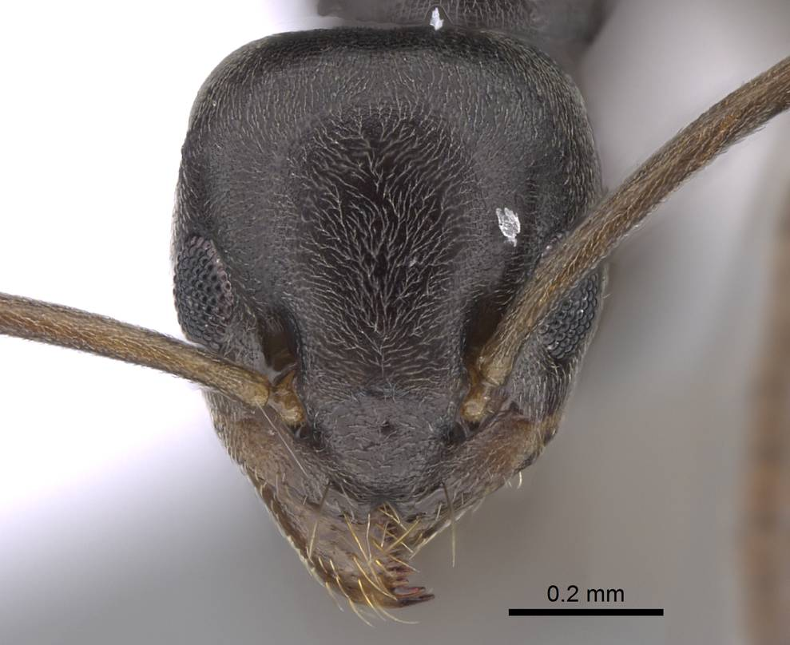
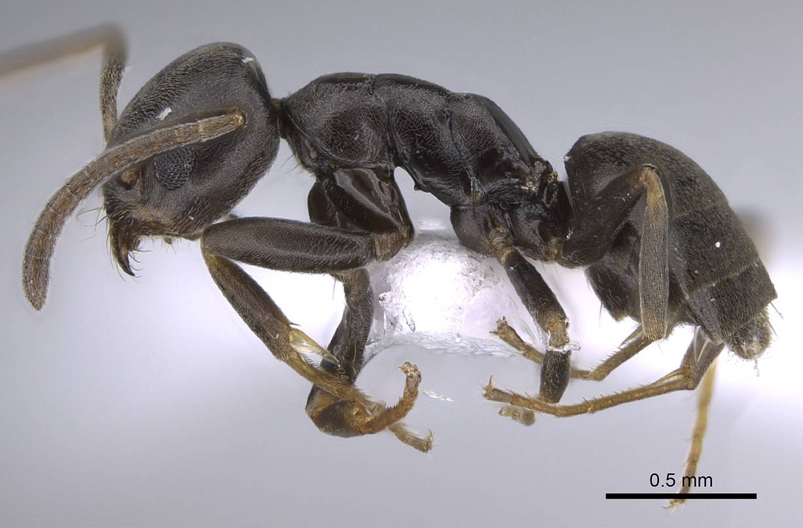

# **Tapinoma subboreale** Seifert, 2012

```{marginfigure}
```

```{r eval=TRUE, echo=FALSE, purl=FALSE, fig.margin = TRUE}

```

```{r eval=TRUE, echo=FALSE, purl=FALSE}

```

```{block, type="attribution"}
Photos by Michele Esposito / From www.antweb.org. Accessed 6 January 2017
Image Copyright © AntWeb 2002 - 2016. Licensing: Creative Commons Attribution License.
```

## Worker
Member of subfamily *Dolichoderinae* with single waist hidden under gaster and sting absent.

Like *Tapinoma erraticum* raises gaster when disturbed producing distinctive repellent smell and has transverse posterior orifice slit but clypeus anterior margins narrow and triangular.

Predator on invertebrates and occasionally tends aphids.

## Nest
Small mounds of coarse debris, around small plants or metal object, under stones or bare ground on hot dry heathland sites, often with small raised solaria of soil and vegetation fragments. Nest with hundreds of workers. Pupae naked.

```{r eval=TRUE, echo=FALSE, purl=FALSE, fig.margin = TRUE}
knitr::include_graphics("images//Tapinoma_subboreale//Tapinoma_subboreale_map.png")
```
`r margin_note("Data courtesy of the NBN Gateway and provided by BWARS.")`
`r margin_note("Crown copyright and database rights 2011 Ordnance Survey [100017955].")`

## Alates
Mating flights in June and July. Unlike *Tapinoma erraticum* male genitalia with narrow subgenital plate and triangular apical lobes.

\pagebreak