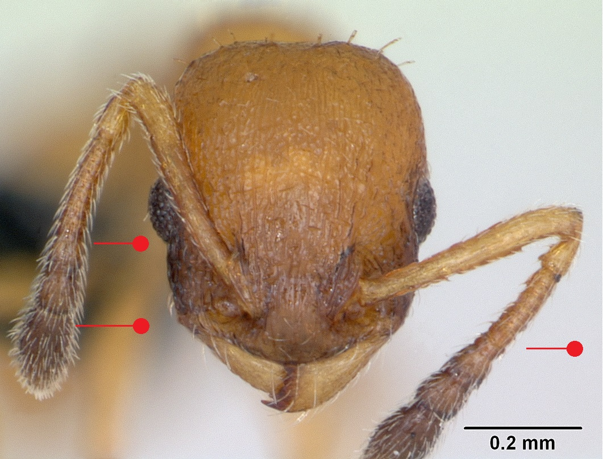
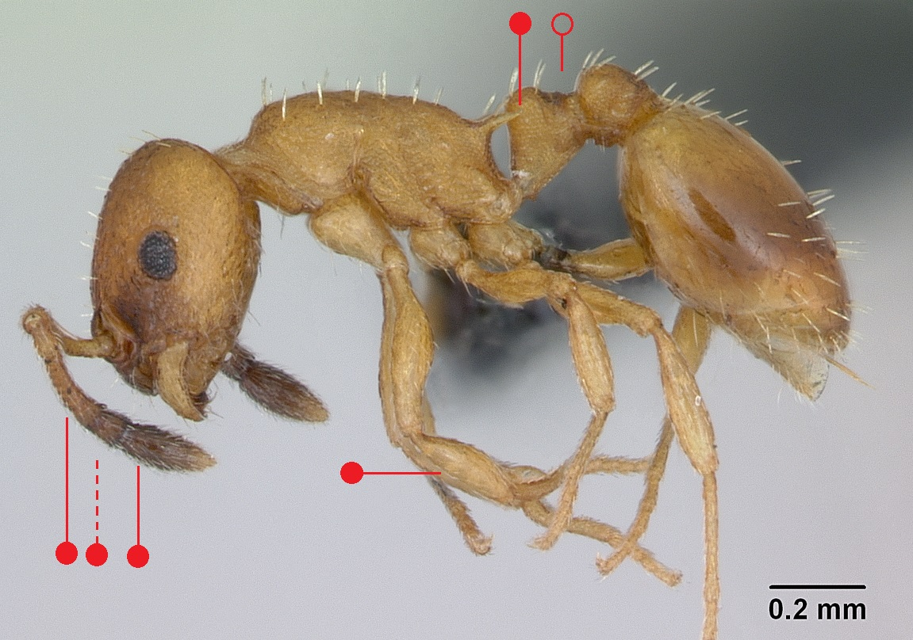

# **Temnothorax interruptus** (Schenck, 1852)

```{marginfigure}
```

```{r eval=TRUE, echo=FALSE, purl=FALSE, fig.margin = TRUE}

```

```{r eval=TRUE, echo=FALSE, purl=FALSE}

```

```{block, type="attribution"}
Photos by April Nobile / From www.antweb.org. Accessed 31 October 2016.
Image Copyright © AntWeb 2002 - 2016. Licensing: Creative Commons Attribution License.
```

## Worker
Member of *Myrmicinae* with **two segments to waist** and **sting present**.

Unlike *Leptothorax acervorum*, **antennae with twelve segments** and **adpressed, slanting long hairs on scape** as well as tibiae. Unlike *Temnothorax nylanderi* **antennal clubs darkened** and **mesopropodeal furrow absent** ^[furrow between mesonotum and propodeum]. Unlike *Temnothorax albipennis* and *Temnothorax unifasciatus* propodeal **spines are long and curved**. Gaster with interrupted dark band.

Scavenges singularly on small invertebrates.

## Nest
In peaty topsoil and dead plant bases, in warm dry areas with sparse low growing vegetation on dry heathland. Single small entrance hole leading down several centimetres to a nest chamber containing a single queen and up to 100 workers. Pupae naked.

```{r eval=TRUE, echo=FALSE, purl=FALSE, fig.margin = TRUE}
knitr::include_graphics("images//temnothorax_interruptus//temnothorax_interruptus_map.png")
```
`r margin_note("Data courtesy of the NBN Gateway and provided by BWARS.")`
`r margin_note("Crown copyright and database rights 2011 Ordnance Survey [100017955].")`

## Alates
Mating flight in July to August. Unlike *Leptothorax acervorum* male with **thirteen antennal segments**.

\pagebreak