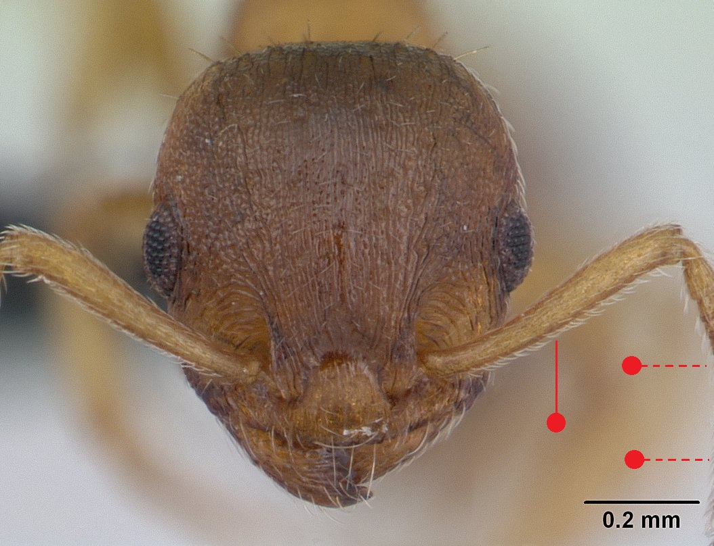

# **Temnothorax nylanderi** (Föerster, 1850)

```{marginfigure}
```

```{r eval=TRUE, echo=FALSE, purl=FALSE, fig.margin = TRUE}

```

```{r eval=TRUE, echo=FALSE, purl=FALSE}

```

```{block, type="attribution"}
Photos by April Nobile / From www.antweb.org. Accessed 31 October 2016.
Image Copyright © AntWeb 2002 - 2016. Licensing: Creative Commons Attribution License.
```

## Worker
Member of *Myrmicinae* with **two segments to waist** and **sting present**.

Unlike *Leptothorax acervorum*, smaller and paler, **antennae with twelve segments** and **adpressed, slanting long hairs on scape** as well as tibiae. Unlike *Temnothorax albipennis* and *Temnothorax interruptus* **antennal clubs not darkened** and **mesopropodeal furrow** present ^[furrow between mesonotum and propodeum]. Gaster with dark band.

Small aggressive ant that does not produce scent to avoid detection by other ant species, using pair-running to forage for food along cracks in bark.

## Nest
Favours shaded, sheltered positions, usually in dead wood with one queen and tens of workers, under bark of old oak tree trunks in parkland, along with *Lasius brunneus*, as well as other cavities such as nutshells. Occasionally several queens in larger nest with over a hundred workers. Pupae naked.

```{r eval=TRUE, echo=FALSE, purl=FALSE, fig.margin = TRUE}
knitr::include_graphics("images//temnothorax_nylanderi//temnothorax_nylanderi_map.png")
```
`r margin_note("Data courtesy of the NBN Gateway and provided by BWARS.")`
`r margin_note("Crown copyright and database rights 2011 Ordnance Survey [100017955].")`

## Alates
Mating flights in warm evenings in August. Reproductive forms intermediate between queens and workers can occur. Unlike *Leptothorax acervorum* male with **thirteen antennal segments**.

\pagebreak