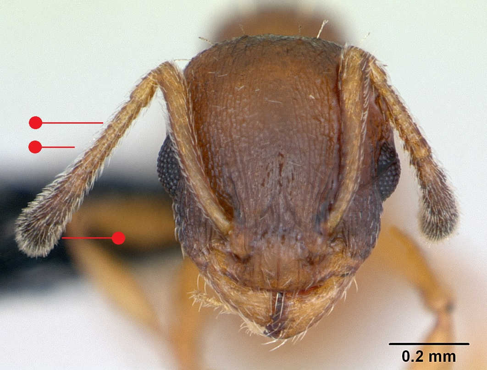

# **Temnothorax unifasciatus** (Latreille, 1798)

```{marginfigure}
```


```{r eval=TRUE, echo=FALSE, purl=FALSE, fig.margin = TRUE}

```

```{r eval=TRUE, echo=FALSE, purl=FALSE}

```

```{block, type="attribution"}
Photos by April Nobile / From www.antweb.org. Accessed 31 October 2016.
Image Copyright © AntWeb 2002 - 2016. Licensing: Creative Commons Attribution License.
```

## Worker
Member of *Myrmicinae* with two segments to waist and sting present.

Unlike *Leptothorax acervorum*, 12 [antennal segments](#glossary) and adpressed, slanting long hairs on [scape](#glossary) as well as [tibiae](#glossary). Unlike *Temnothorax nylanderi*, in addition to [antennal clubs](#glossary) darkened, *Temnothorax interruptus*, in addition to short [propodeal spines](#glossary) and *Temnothorax albipennis* [gaster](#glossary) has clearly-defined, continuous dark band.

## Nest
In the Channel Islands, among rocks and under stones in warm, dry open areas, as well as in dead tree branches, under bark and in hollow plant stems. Single queen with up to 200 or more workers. In Europe may interbreed with *Temnothorax albipennis* producing hybrid colonies. Pupae naked.

```{r eval=TRUE, echo=FALSE, purl=FALSE, fig.margin = TRUE}
knitr::include_graphics("images//temnothorax_unifasciatus//temnothorax_unifasciatus_map.png")
```
`r margin_note("Data courtesy of the NBN Gateway and provided by BWARS.")`
`r margin_note("Crown copyright and database rights 2011 Ordnance Survey [100017955].")`

## Alates
Mating flights in July and August. Unlike *Leptothorax acervorum* male with 13 [antennal segments](#glossary).

\pagebreak