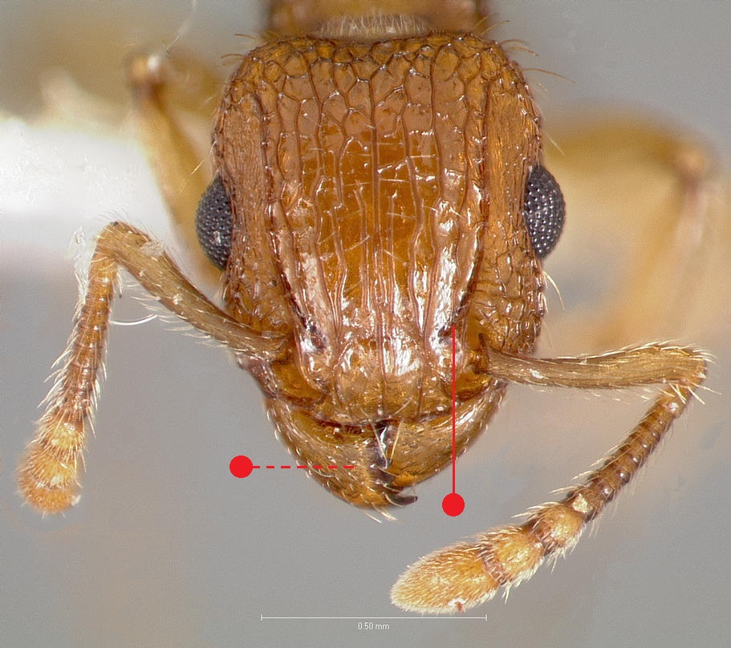
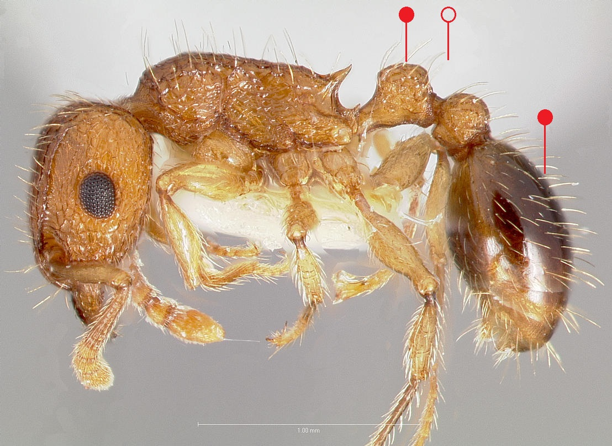

# **Tetramorium bicarinatum** (Nylander, 1846)

```{marginfigure}
```

```{r eval=TRUE, echo=FALSE, purl=FALSE, fig.margin = TRUE}
knitr::include_graphics("images//labels//tramp.png")
```

```{r eval=TRUE, echo=FALSE, purl=FALSE, fig.margin = TRUE}

```

```{r eval=TRUE, echo=FALSE, purl=FALSE, fig.margin = TRUE}

```

```{r eval=TRUE, echo=FALSE, purl=FALSE}

```

```{block, type="attribution"}
Photo by / From www.antweb.org. Accessed 19 December 2016.
Image Copyright © AntWeb 2002 - 2016. Licensing: Creative Commons Attribution License.
```

## Worker
Introduced member of *Myrmicinae* with two segments to waist and sting present.

Like *Tetramorium cespitosum* and *Tetramorium simillimum* [clypeus margin](#glossary) raised into a transverse ridge but bicoloured having yellow-brown head and [mesosoma](#glossary) with darker blackish-brown [gaster](#glossary), [petiole](#glossary) rectangular with angles of upper surface at same height ^[antero- and posterodorsal angles] and [mandibles](#glossary) sculptured.

## Nest
Can survive in constantly heated buildings. Pupae naked.

```{r eval=TRUE, echo=FALSE, purl=FALSE, fig.margin = TRUE}

```
`r margin_note("Data courtesy of the NBN Gateway and provided by BWARS.")`
`r margin_note("Crown copyright and database rights 2011 Ordnance Survey [100017955].")`

\pagebreak