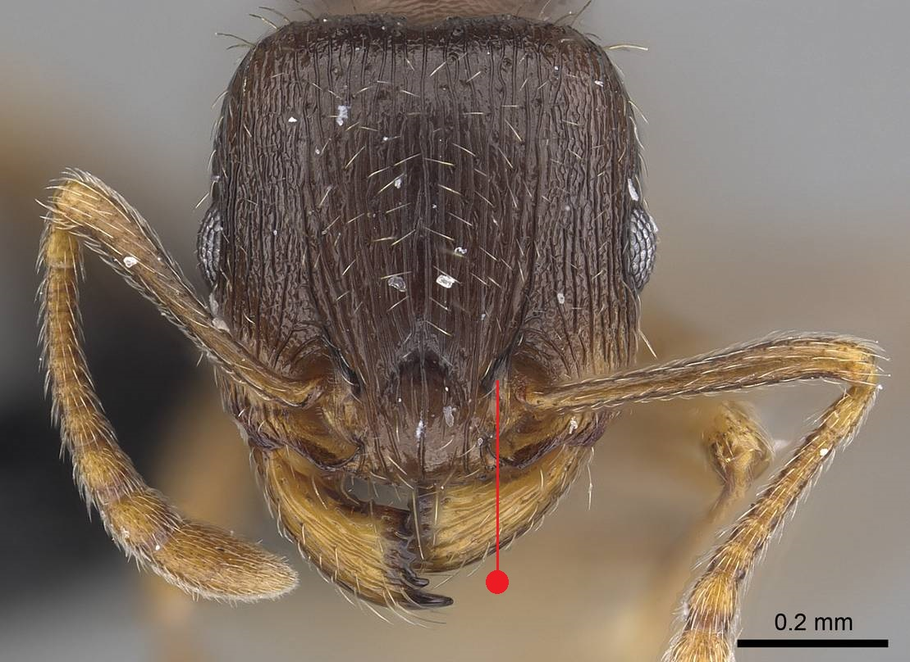
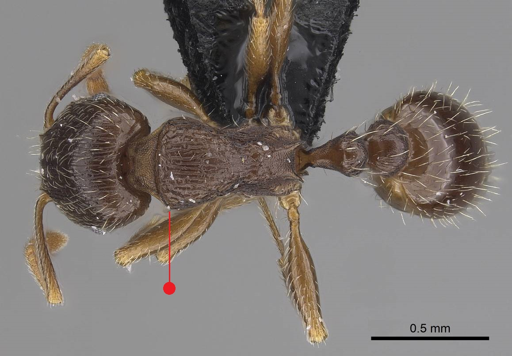
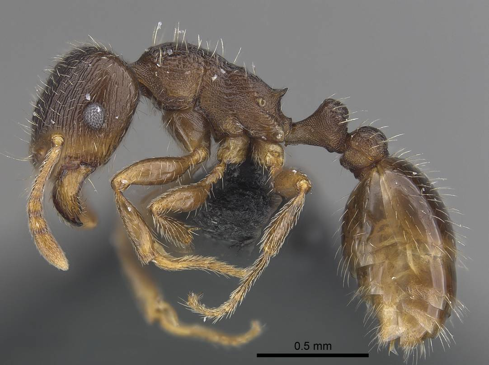
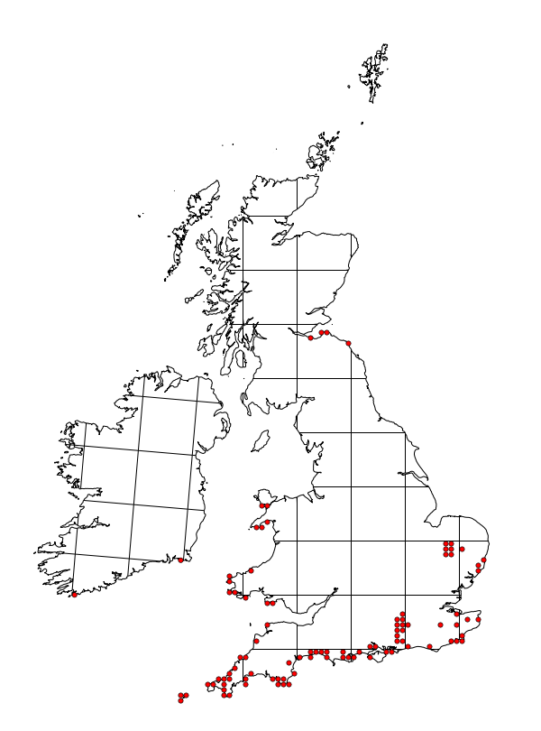

# **Tetramorium caespitum** (Linnaeus, 1758)

```{marginfigure}
```

```{r eval=TRUE, echo=FALSE, purl=FALSE, fig.margin = TRUE}

```

```{r eval=TRUE, echo=FALSE, purl=FALSE, fig.margin = TRUE}

```


```{r eval=TRUE, echo=FALSE, purl=FALSE}

```

```{block, type="attribution"}
Photos by Flavia Esteves / From www.antweb.org. Accessed 3 November 2016.
Image Copyright © AntWeb 2002 - 2016. Licensing: Creative Commons Attribution License.
```

## Worker
Member of *Myrmicinae* with two segments to waist and sting present.

Aggressive, stinging ant with [clypeus margin](#glossary) raised into a transverse ridge, angled corners to [prothorax](#glossary) ^[not in glossary] and short [propodeal spines](#glossary).

Stores grass, heather and birch seeds which are feed to the brood and tends subterranean aphid *Paracletus cimiciformis*. Forages for prey and honeydew with recruitment occurring along defined scent trails.

## Nest
Large colonies with normally one queen and thousands of workers under stones in coastal sand, close cropped grassland with surface stones, crumbling rocky cliff tops and inland dry heaths in hot sites. Requiring heathland management to maintain bare ground, often found along with other thermophilous species such as *Lasius alienus*. 

Unlike parasite *Tetramorium atratulum*, larvae white with hairs on head. Also parasitised by *Strongylognathus testaceous*. Pupae naked.

```{r eval=TRUE, echo=FALSE, purl=FALSE, fig.margin = TRUE}

```
`r margin_note("Data courtesy of the NBN Gateway and provided by BWARS.")`
`r margin_note("Crown copyright and database rights 2011 Ordnance Survey [100017955].")`

## Alates
Mating flight in late June to early August. Alates larger than workers.

\pagebreak